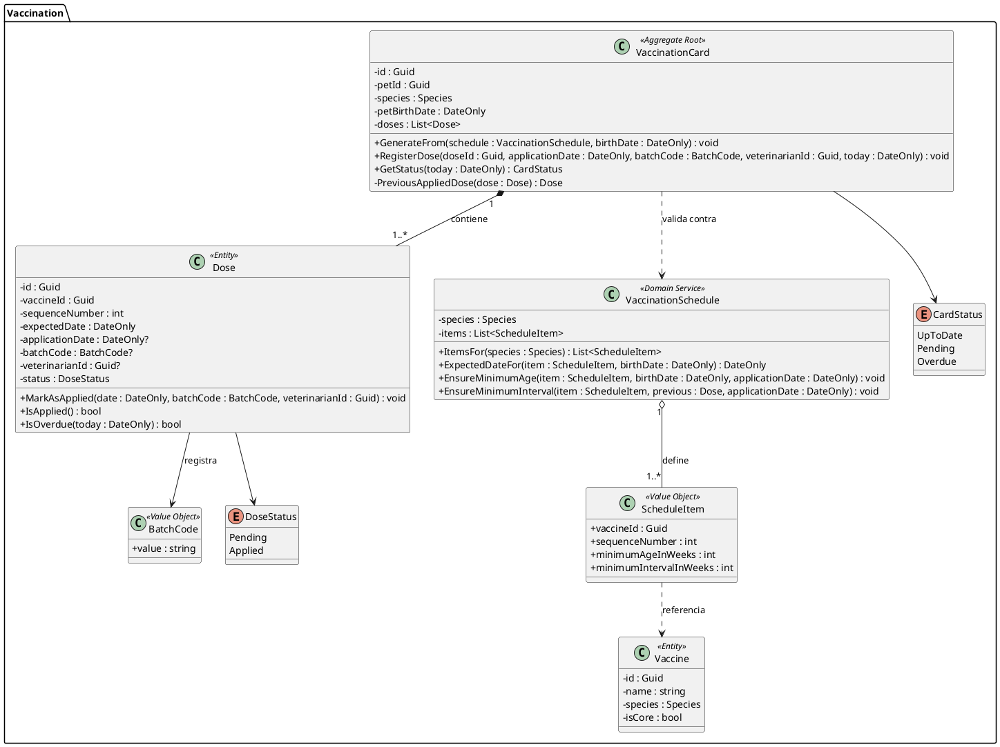
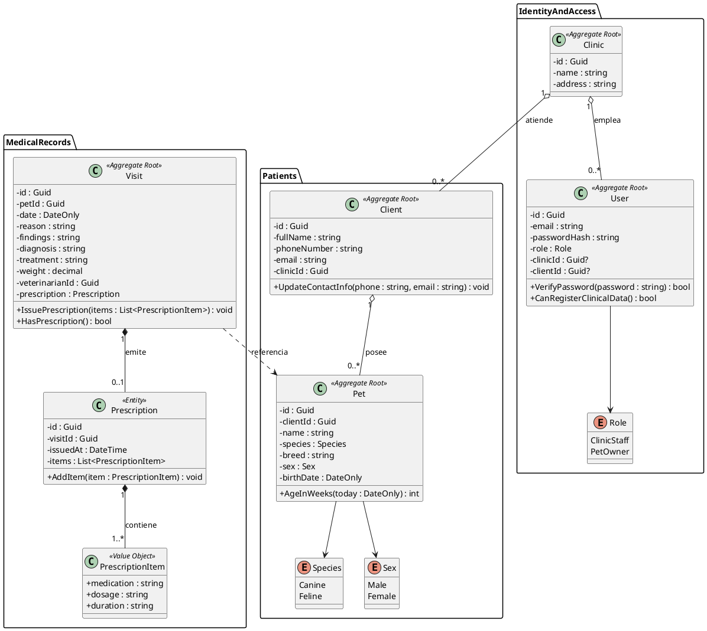
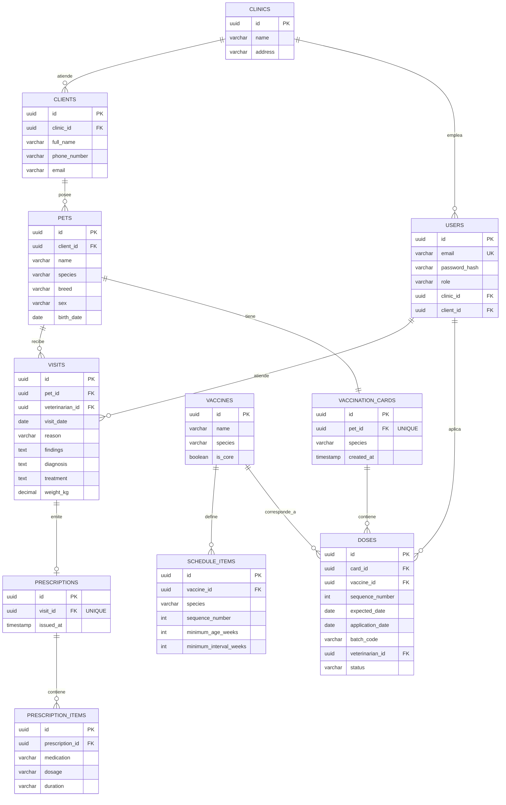

# VetPass — Informe de Proyecto Final

**Universidad Peruana de Ciencias Aplicadas**
**Carrera de Ingeniería de Software**
**Curso:** 1ASI0732 — Diseño de Experimentos de Ingeniería de Software
**Sección:** NRC 9086
**Startup:** PawCode Studio
**Producto:** VetPass — Plataforma de cartilla de vacunación digital e historial veterinario

---

## Nota sobre este documento

Este documento reúne los capítulos I a IV del informe. Los diagramas y piezas
visuales que deben insertarse como imagen están señalados con marcadores
`[Insertar aquí …]`, y allí donde el diagrama tiene una representación textual se
incluye su código fuente: Structurizr DSL para los diagramas C4 de la sección
4.8, PlantUML para los diagramas de clases de la sección 4.9 y Mermaid para el
diagrama entidad-relación de la sección 4.10.

Las secciones que requieren contenido elaborado en herramientas externas
(UXPressia, Miro) incluyen además el contenido completo de cada ficha, mapa o
tabla, de modo que solo reste transferirlo a la herramienta y capturar la imagen.

---

## Tabla de contenidos

- **Capítulo I: Introducción** — 1.1 Startup Profile · 1.2 Solution Profile · 1.3 Segmentos objetivo
- **Capítulo II: Requirements Elicitation & Analysis** — 2.1 Competidores · 2.2 Entrevistas · 2.3 Needfinding · 2.4 Ubiquitous Language
- **Capítulo III: Requirements Specification** — 3.1 To-Be Scenario Mapping · 3.2 User Stories · 3.3 Product Backlog · 3.4 Impact Mapping
- **Capítulo IV: Product Design** — 4.1 Style Guidelines · 4.2 Information Architecture · 4.3 Landing Page UI Design · 4.4 Mobile Applications UX/UI Design · 4.5 Mobile Applications Prototyping · 4.6 Web Applications UX/UI Design · 4.7 Web Applications Prototyping · 4.8 Domain-Driven Software Architecture · 4.9 Software Object-Oriented Design · 4.10 Database Design

---


# Capítulo I: Introducción

## 1.1. Startup Profile

### 1.1.1. Descripción de la Startup

PawCode Studio es una startup de desarrollo de software conformada por
estudiantes de la carrera de Ingeniería de Software de la Universidad
Peruana de Ciencias Aplicadas. Nace con el propósito de llevar procesos
administrativos y clínicos que aún dependen del papel hacia soluciones
digitales confiables, verificables y accesibles para negocios de pequeña
y mediana escala del Perú.

Nuestro primer producto es **VetPass**, una plataforma web y móvil que
digitaliza la cartilla de vacunación y el historial veterinario de perros
y gatos. La plataforma permite que el personal de la clínica registre la
información desde una aplicación web, mientras que el dueño de la mascota
la consulta en cualquier momento desde una aplicación móvil, eliminando
la dependencia de documentos físicos expuestos a pérdida o deterioro.

**Misión:** Digitalizar la gestión de la información clínica de mascotas
en clínicas veterinarias pequeñas y medianas del Perú, mediante productos
de software construidos con altos estándares de calidad, verificación
continua y diseño centrado en el usuario.

**Visión:** Ser en los próximos cinco años la plataforma de referencia en
el Perú para el registro y consulta del historial sanitario de mascotas,
reconocida por la confiabilidad de su información y por la calidad de su
ingeniería.

### 1.1.2. Perfiles de integrantes del equipo

A continuación se presentan los perfiles de los integrantes de PawCode
Studio, indicando sus datos de identificación académica y los principales
conocimientos técnicos y habilidades que cada uno aporta al equipo.

| Foto | Nombres y Apellidos | Código de estudiante | Carrera | Conocimientos técnicos y habilidades |
|------|---------------------|----------------------|---------|--------------------------------------|
|  | Apellido Apellido, Nombre | U20XXXXXX | Ingeniería de Software | |
|  | Apellido Apellido, Nombre | U20XXXXXX | Ingeniería de Software | |
|  | Apellido Apellido, Nombre | U20XXXXXX | Ingeniería de Software | |
|  | Apellido Apellido, Nombre | U20XXXXXX | Ingeniería de Software | |
|  | Apellido Apellido, Nombre | U20XXXXXX | Ingeniería de Software | |

## 1.2. Solution Profile

### 1.2.1. Antecedentes y problemática

#### Análisis previo: The 5 'W's and 2 'H's

Antes de redactar los antecedentes y la problemática, el equipo aplicó la
técnica de análisis 5W+2H sobre el dominio del problema, con el fin de
delimitarlo de forma precisa y evitar conclusiones apresuradas.

| Dimensión | Pregunta guía | Hallazgo |
|-----------|---------------|----------|
| **What** (Qué) | ¿Cuál es el problema? | El historial clínico de las mascotas y su cartilla de vacunación se gestionan en papel. La cartilla queda en poder del dueño y el historial queda en la clínica, de modo que ningún actor posee el registro completo del animal, y ambos documentos son susceptibles de pérdida, deterioro u olvido. |
| **Who** (Quién) | ¿A quiénes afecta? | Al personal de clínicas veterinarias pequeñas y medianas (médico veterinario tratante y personal de recepción), responsable de registrar y consultar la información clínica; y a los dueños de perros y gatos, responsables de custodiar la cartilla física y de informar los antecedentes del animal en cada atención. |
| **Where** (Dónde) | ¿Dónde ocurre? | En clínicas y consultorios veterinarios independientes de Lima Metropolitana, que no cuentan con sistemas de información clínica y operan con registros manuales. |
| **When** (Cuándo) | ¿Cuándo se manifiesta? | En el momento de la atención, cuando el veterinario requiere los antecedentes del paciente y no dispone de ellos; cuando el dueño extravía o deteriora la cartilla; y cuando el dueño acude por primera vez a una clínica distinta y no puede acreditar el historial de vacunación de su mascota. |
| **Why** (Por qué) | ¿Por qué es relevante resolverlo? | Porque la ausencia de información verificable conduce a decisiones clínicas tomadas sobre datos incompletos, a la repetición u omisión de dosis de vacunas, y a reprocesos administrativos que consumen tiempo de atención. Además, compromete la trazabilidad sanitaria del animal a lo largo de su vida. |
| **How** (Cómo) | ¿Cómo ocurre actualmente? | La clínica registra cada atención de forma manuscrita en fichas u hojas que se archivan apiladas o en folders físicos, sin índice ni respaldo. Paralelamente, entrega al dueño una cartilla de vacunación impresa que se completa a mano en cada dosis aplicada. No existe copia de seguridad de ninguno de los dos documentos. |
| **How much** (Cuánto) | ¿Cuál es la magnitud? | El INEI (2026) reporta que el 64,0% de los hogares peruanos tiene al menos una mascota, con un total de 17 263 000 animales de compañía a nivel nacional, de los cuales el 56,5% son perros y el 36,2% son gatos. En Lima Metropolitana, el 59,6% de los hogares cuenta con algún animal de compañía. Cada uno de esos animales requiere, como mínimo, un esquema de vacunación documentado y verificable. |

#### Antecedentes

La tenencia de animales de compañía en el Perú alcanza una escala
significativa. Según el módulo "Crianza de mascotas en el hogar" de la
Encuesta Nacional de Hogares, incorporado por el Instituto Nacional de
Estadística e Informática (INEI) en 2025 y difundido en 2026, el 64,0% de
los hogares del país tiene al menos una mascota, con un promedio de 2,5
animales por hogar. El 52,2% de los hogares cuenta con al menos un perro
y el 33,0% con al menos un gato, lo que confirma a ambas especies como
las predominantes en el dominio del problema.

Este volumen de animales sostiene una red amplia de clínicas y
consultorios veterinarios, en su mayoría negocios independientes de
pequeña y mediana escala. En dichos establecimientos, la gestión de la
información clínica continúa apoyándose en instrumentos físicos: fichas
manuscritas de atención que se archivan en folders, y una cartilla de
vacunación impresa que se entrega al dueño de la mascota y se completa a
mano cada vez que se aplica una dosis.

Este esquema de trabajo divide el expediente del animal en dos mitades
que nunca se encuentran. La clínica conserva el registro de las atenciones
que ella misma brindó, pero no necesariamente el de las vacunas aplicadas
en otros establecimientos. El dueño conserva la cartilla, pero no el
detalle clínico de cada consulta. Cuando cualquiera de las dos mitades se
pierde, no existe mecanismo alguno de recuperación, porque no hay copia
de respaldo.

#### Problemática

La gestión en papel del historial veterinario y de la cartilla de
vacunación de perros y gatos genera pérdida de información clínica
irrecuperable y decisiones médicas basadas en antecedentes incompletos.

Los puntos más importantes que la solución debe resolver son los
siguientes:

1. **Fragilidad del soporte físico.** La cartilla de vacunación es un
   documento de papel que acompaña al animal durante toda su vida y que
   se extravía, se moja o se deteriora con facilidad. Cuando esto ocurre,
   el registro histórico de dosis aplicadas se pierde por completo.

2. **Ausencia de respaldo del historial clínico.** Las fichas de atención
   apiladas en la clínica carecen de copia de seguridad y de un criterio
   de organización que permita recuperar con rapidez los antecedentes de
   un paciente determinado.

3. **Información dispersa entre actores.** Ni la clínica ni el dueño
   poseen individualmente el expediente completo del animal, lo que
   obliga al veterinario a reconstruir los antecedentes a partir de lo
   que el dueño recuerda.

4. **Falta de control sobre el esquema de vacunación.** Al registrarse
   las dosis de forma manuscrita y sin validación, resulta difícil
   determinar con certeza qué vacunas le corresponden a la mascota según
   su especie y edad, cuáles ya recibió y cuáles se encuentran
   pendientes o vencidas.

5. **Imposibilidad de consulta por parte del dueño.** El dueño solo puede
   revisar la información de su mascota si conserva físicamente la
   cartilla, y no tiene acceso alguno al detalle de las atenciones
   registradas por la clínica.

#### Objetivos de la solución

**Objetivo general**

Desarrollar una plataforma de software compuesta por una aplicación web y
una aplicación móvil que permita a las clínicas veterinarias registrar y
mantener de forma digital la cartilla de vacunación y el historial
veterinario de perros y gatos, y que permita a los dueños consultar dicha
información en cualquier momento.

**Objetivos específicos**

- Generar automáticamente la cartilla de vacunación de una mascota a
  partir del esquema de vacunación correspondiente a su especie, al
  momento de su registro en la plataforma.
- Permitir al personal veterinario registrar la aplicación de cada dosis
  y determinar el estado de la cartilla de la mascota.
- Permitir al personal veterinario registrar las atenciones del historial
  veterinario mediante un formato preestablecido.
- Permitir al dueño consultar desde su dispositivo móvil el perfil, la
  cartilla de vacunación y el historial de cada una de sus mascotas.
- Permitir la emisión de recetas médicas asociadas a una atención y su
  consulta por parte del dueño.

#### Restricciones y delimitación del alcance

El alcance del proyecto se delimita de forma deliberada para concentrar
el esfuerzo del equipo en la calidad de la construcción, la verificación
y la validación del producto, que constituyen el objeto del curso. En
consecuencia, se establecen las siguientes restricciones:

- La plataforma soporta únicamente las especies **canina y felina**, por
  ser las predominantes en la atención veterinaria de acuerdo con las
  cifras del INEI citadas.
- El registro y la edición de información clínica son atribución
  exclusiva del personal de la clínica veterinaria. El dueño de la
  mascota dispone únicamente de permisos de consulta.
- El esquema de vacunación por especie se administra como una plantilla
  predefinida en el sistema, y no es configurable por el usuario final
  en esta versión del producto.
- Quedan fuera del alcance: la reserva de citas, los módulos de pagos y
  facturación, la gestión de inventario de medicamentos, los servicios
  de baño y estética, la telemedicina, las notificaciones push, el
  comercio electrónico y la administración de cadenas veterinarias con
  múltiples sedes.

### 1.2.2. Lean UX Process

El equipo aplicó el proceso Lean UX sobre el dominio del problema, con el
propósito de partir de supuestos explícitos y convertirlos en hipótesis
verificables, en lugar de asumir como válida la solución inicialmente
imaginada. El resultado de este proceso se presenta a continuación en
cuatro artefactos: los enunciados de problema, los supuestos, las
hipótesis y el Lean UX Canvas que los consolida.

#### 1.2.2.1. Lean UX Problem Statements

**Dominio**

Gestión de la información clínica y sanitaria de animales de compañía en
clínicas veterinarias de pequeña y mediana escala.

**Segmentos de clientes**

Personal de clínicas veterinarias independientes de Lima Metropolitana
(médico veterinario tratante y personal de recepción), y dueños de perros
y gatos atendidos en dichos establecimientos.

**Pain points**

El registro clínico manuscrito carece de respaldo y de un criterio de
recuperación rápida; la cartilla de vacunación en papel se extravía y se
deteriora; el expediente del animal queda dividido entre la clínica y el
dueño, de modo que ninguno de los dos lo posee completo; y no existe un
control confiable sobre qué dosis del esquema de vacunación corresponden
a la mascota, cuáles ya recibió y cuáles están pendientes o vencidas.

**Gap**

Existen sistemas de gestión veterinaria en el mercado, pero se orientan
principalmente a la administración comercial del negocio (citas,
facturación, inventario) y no resuelven el acceso del dueño a la
información sanitaria de su mascota. A la vez, las clínicas pequeñas
carecen de una herramienta accesible que digitalice específicamente la
cartilla de vacunación con las reglas del esquema sanitario incorporadas,
por lo que permanecen en el papel.

**Visión y estrategia**

La visión es que el expediente sanitario de una mascota deje de depender
de un documento físico y pase a residir en una plataforma en la que la
clínica lo construye y el dueño lo consulta. La estrategia consiste en
comenzar por el activo de información más frágil y a la vez más
normalizado —la cartilla de vacunación de perros y gatos—, generándola de
forma automática a partir del esquema de cada especie, y extender desde
allí hacia el historial de atenciones.

**Segmento inicial**

Clínicas veterinarias independientes de Lima Metropolitana con uno a tres
médicos veterinarios, que actualmente gestionan sus registros en papel y
no cuentan con un sistema de información clínica.

**Enunciados de problema**

*Enunciado 1 — Segmento clínica veterinaria*

Las clínicas veterinarias independientes registran el historial de sus
pacientes en fichas manuscritas y entregan a sus clientes una cartilla de
vacunación impresa. Hemos observado que este esquema no permite conservar
un expediente sanitario completo ni verificable de cada animal, lo cual
está causando que los veterinarios tomen decisiones clínicas sobre
antecedentes incompletos y que se inviertan minutos de la consulta en
reconstruir información que debería estar disponible. ¿Cómo podríamos
digitalizar el registro clínico y la cartilla de vacunación de modo que
el personal de la clínica disponga del expediente completo de cada
paciente al iniciar una atención?

*Enunciado 2 — Segmento dueño de mascota*

Los dueños de perros y gatos custodian la cartilla de vacunación de su
mascota en papel y desconocen el detalle de las atenciones registradas
por la clínica. Hemos observado que este documento se extravía y se
deteriora, y que su pérdida es irreversible, lo cual está causando que el
dueño no pueda acreditar el estado de vacunación de su mascota ni
determinar qué dosis le corresponden a continuación. ¿Cómo podríamos
ofrecer al dueño acceso permanente y confiable a la cartilla y al
historial de su mascota de modo que deje de depender de un documento
físico?

#### 1.2.2.2. Lean UX Assumptions

**Supuestos de negocio (Business Assumptions)**

1. Creemos que las clínicas veterinarias independientes de Lima
   Metropolitana gestionan mayoritariamente sus registros clínicos en
   papel.
2. Creemos que el personal veterinario percibe la reconstrucción de
   antecedentes de un paciente como una pérdida de tiempo dentro de la
   consulta.
3. Creemos que la pérdida o el deterioro de la cartilla de vacunación es
   un hecho frecuente y no un caso aislado.
4. Creemos que ofrecer al cliente acceso digital a la información de su
   mascota constituye un diferencial de servicio que la clínica valora.
5. Creemos que el esquema de vacunación de perros y de gatos está
   suficientemente estandarizado como para ser modelado en una plantilla
   predefinida por especie.
6. Creemos que las clínicas del segmento inicial disponen de una
   computadora con acceso a internet en el área de atención.
7. Creemos que los dueños de mascotas del segmento cuentan con un
   teléfono inteligente y están dispuestos a instalar una aplicación para
   consultar la información de su mascota.
8. Creemos que la clínica no aceptaría que el dueño pudiera editar el
   contenido clínico registrado por el veterinario.
9. Creemos que el mercado al que nos dirigimos es suficientemente amplio
   como para sostener el producto, considerando el volumen de tenencia de
   mascotas reportado por el INEI.

**Supuestos de usuario (User Assumptions)**

| Pregunta | Supuesto del equipo |
|----------|---------------------|
| ¿Quién es el usuario? | Por un lado, el médico veterinario y el personal de recepción de una clínica independiente. Por otro, el dueño de un perro o un gato atendido en esa clínica. |
| ¿Dónde encaja nuestro producto en su trabajo o vida? | En la clínica, durante el momento de la atención y el registro posterior. En el caso del dueño, en los momentos puntuales en que necesita consultar el estado sanitario de su mascota. |
| ¿Qué problemas resuelve nuestro producto? | Elimina la dependencia del papel como único soporte del expediente sanitario y hace que la información sea recuperable y consultable por ambas partes. |
| ¿Cuándo y cómo es usado nuestro producto? | La aplicación web se usa de forma continua durante la jornada de atención de la clínica. La aplicación móvil se usa de forma esporádica, cuando el dueño necesita verificar la cartilla o revisar una indicación. |
| ¿Qué características son importantes? | La generación automática de la cartilla según la especie, el registro de dosis aplicadas, el estado de la cartilla, el historial de atenciones y la consulta desde el móvil. |
| ¿Cómo debe verse y comportarse nuestro producto? | Debe replicar de forma reconocible la estructura de la cartilla de vacunación física, para que el usuario no necesite reaprender un formato que ya conoce. |

**Supuestos de funcionalidad (Feature Assumptions)**

1. Creemos que generar la cartilla de forma automática al registrar la
   mascota reduce el esfuerzo de registro frente a crearla dosis por
   dosis de manera manual.
2. Creemos que mostrar el estado de la cartilla (al día, pendiente o
   vencida) es más útil para el usuario que presentar únicamente la lista
   de dosis registradas.
3. Creemos que validar automáticamente la edad mínima y el intervalo
   entre dosis previene errores de registro que hoy no se detectan.
4. Creemos que un formato preestablecido de atención resulta más rápido
   de completar para el veterinario que un campo de texto libre.
5. Creemos que el dueño consultará la cartilla con mayor frecuencia que
   el historial de atenciones.

#### 1.2.2.3. Lean UX Hypothesis Statements

Los supuestos anteriores se convierten en las siguientes hipótesis,
formuladas de modo que puedan ser verificadas mediante las entrevistas de
validación y la observación del uso del producto.

**Hipótesis 1**

Creemos que **reduciremos el tiempo que el personal veterinario dedica a
reconstruir los antecedentes de un paciente** si **el médico veterinario
de una clínica independiente** obtiene **el expediente completo de la
mascota en una sola pantalla** con **la funcionalidad de historial
veterinario digital**. Sabremos que esto es cierto cuando **el veterinario
localice los antecedentes de un paciente registrado sin recurrir a
archivos físicos durante las sesiones de validación**.

**Hipótesis 2**

Creemos que **eliminaremos la pérdida irrecuperable del registro de
vacunación** si **el dueño de un perro o un gato** obtiene **acceso
permanente a la cartilla de su mascota desde su teléfono** con **la
funcionalidad de consulta de cartilla digital en la aplicación móvil**.
Sabremos que esto es cierto cuando **los dueños entrevistados accedan a la
cartilla de su mascota sin requerir el documento físico**.

**Hipótesis 3**

Creemos que **reduciremos los errores de registro en el esquema de
vacunación** si **el personal de la clínica** obtiene **advertencias
automáticas ante dosis aplicadas fuera de la edad mínima o del intervalo
establecido** con **las reglas de validación incorporadas en la cartilla
digital**. Sabremos que esto es cierto cuando **el sistema rechace los
registros inválidos presentados durante las pruebas de aceptación y los
usuarios reconozcan el mensaje de advertencia como comprensible**.

**Hipótesis 4**

Creemos que **agilizaremos el registro de una nueva mascota** si **el
personal de recepción** obtiene **la cartilla de vacunación ya
estructurada según la especie** con **la funcionalidad de generación
automática a partir de la plantilla de esquema**. Sabremos que esto es
cierto cuando **el personal complete el registro de una mascota sin
necesidad de definir manualmente las dosis que le corresponden**.

**Hipótesis 5**

Creemos que **mejoraremos la comprensión del dueño sobre el estado
sanitario de su mascota** si **el dueño** obtiene **un indicador explícito
del estado de la cartilla y de la próxima dosis esperada** con **la vista
de estado de cartilla en la aplicación móvil**. Sabremos que esto es
cierto cuando **los dueños entrevistados identifiquen correctamente la
siguiente dosis pendiente de su mascota sin ayuda del entrevistador**.

**Hipótesis 6**

Creemos que **incrementaremos la percepción de calidad del servicio de la
clínica** si **el cliente de la veterinaria** obtiene **acceso a las
recetas e indicaciones emitidas en su consulta** con **la funcionalidad de
recetas digitales consultables desde el móvil**. Sabremos que esto es
cierto cuando **los dueños entrevistados manifiesten preferencia por una
clínica que ofrezca este acceso frente a una que no lo ofrezca**.

#### 1.2.2.4. Lean UX Canvas

[Insertar aquí la imagen del Lean UX Canvas elaborado en Miro]

*Figura X. Lean UX Canvas de VetPass. Elaboración propia.*

#### Contenido del Lean UX Canvas (caja por caja)

| # | Caja | Contenido |
|---|---|---|
| 1 | Business Problem | Las clínicas veterinarias independientes gestionan el historial clínico en papel y entregan la cartilla de vacunación impresa, lo que produce pérdida irrecuperable de información sanitaria y decisiones clínicas sobre antecedentes incompletos. |
| 2 | Business Outcomes | Clínicas que registran sus atenciones íntegramente en la plataforma; mascotas con cartilla digital activa; dueños que acceden a la app al menos una vez tras la consulta; retención de la clínica tras el primer mes de uso. |
| 3 | Users | Médico veterinario tratante, personal de recepción de la clínica, y dueño de perro o gato. |
| 4 | User Outcomes & Benefits | El veterinario inicia la consulta con el expediente completo a la vista. La recepción registra una mascota nueva sin construir la cartilla a mano. El dueño consulta el estado de vacunación de su mascota en cualquier momento y deja de temer la pérdida del papel. |
| 5 | Solutions | Cartilla de vacunación generada automáticamente por especie; registro de dosis con validación de edad e intervalo; historial veterinario con formato preestablecido; recetas digitales; app móvil de consulta para el dueño. |
| 6 | Hypotheses | Las seis hipótesis de la sección 1.2.2.3. |
| 7 | What's the most important thing we need to learn first? | Si el esquema de vacunación de perros y gatos puede modelarse como una plantilla única por especie, o si cada clínica aplica criterios propios que obligarían a hacerlo configurable. De esa respuesta depende toda la arquitectura del contexto de cartilla. |
| 8 | What's the least amount of work we need to do to learn it? | Entrevistar a tres médicos veterinarios de clínicas distintas y contrastar los esquemas que aplican en la práctica, contrastándolos además con la cartilla física que hoy entregan a sus clientes. |

## 1.3. Segmentos objetivo

La solución propuesta atiende a dos segmentos objetivo con roles
complementarios dentro del mismo dominio. El primero corresponde al lado
de la oferta del servicio veterinario y opera la aplicación web; el
segundo corresponde al lado de la demanda y opera la aplicación móvil.
Ambos segmentos interactúan con la misma información clínica, pero con
niveles de permiso distintos.

### Segmento 1: Clínicas veterinarias independientes de Lima Metropolitana

**Descripción**

Consultorios y clínicas veterinarias de propiedad independiente, no
pertenecientes a cadenas, que atienden principalmente animales de
compañía de las especies canina y felina. Cuentan con uno a tres médicos
veterinarios, atienden por consulta ambulatoria y aplican vacunas como
parte regular de su servicio. Gestionan sus registros clínicos en papel y
no disponen de un sistema de información clínica.

**Características demográficas y del negocio**

| Característica | Descripción |
|----------------|-------------|
| Tipo de organización | Micro y pequeña empresa de propiedad familiar o individual |
| Personal de contacto con el sistema | Médico veterinario tratante y personal de recepción o asistencia |
| Edad del personal usuario | Entre 25 y 55 años |
| Nivel educativo | Superior universitario en Medicina Veterinaria en el caso del profesional tratante; técnico o superior en el caso del personal de recepción |
| Ubicación | Distritos de Lima Metropolitana con alta densidad residencial |
| Nivel de digitalización | Bajo. Uso de herramientas ofimáticas generales o de ninguna herramienta digital para el registro clínico |
| Infraestructura disponible | Computadora de escritorio o laptop con acceso a internet en el área de atención |
| Volumen de atención estimado | Entre 10 y 30 atenciones diarias |

**Sustento estadístico**

El tamaño de este segmento se apoya de forma indirecta en el volumen de
animales de compañía que requieren atención veterinaria. De acuerdo con
el Instituto Nacional de Estadística e Informática (INEI, 2026), la
primera medición de la Encuesta Nacional de Hogares sobre tenencia de
mascotas contabilizó 17 263 000 animales de compañía en el país, de los
cuales el 56,5% corresponde a perros y el 36,2% a gatos. Cada uno de
estos animales constituye un paciente potencial que requiere un esquema
de vacunación documentado.

Cabe señalar una limitación metodológica relevante para este segmento: en
el Perú no existe una norma nacional que regule el registro y control de
los establecimientos veterinarios, por lo que no se dispone de un padrón
oficial que permita cuantificarlos con exactitud (Universidad Peruana
Cayetano Heredia). Esta ausencia de formalización registral es
consistente con el perfil del segmento identificado: negocios pequeños,
con procesos poco sistematizados y escasa adopción de herramientas
digitales, que constituyen precisamente la oportunidad que atiende la
solución. Para dimensionar el segmento, el equipo realizó un conteo
referencial de establecimientos veterinarios listados en plataformas de
directorio geográfico en los distritos objetivo, cuyo resultado se
presenta a continuación.

> [Completar con el conteo propio del equipo: distritos considerados,
> fecha del conteo, fuente utilizada y número de establecimientos
> hallados. Declarar explícitamente que se trata de una estimación
> referencial y no de una cifra oficial.]

### Segmento 2: Dueños de perros y gatos en Lima Metropolitana

**Descripción**

Personas responsables del cuidado de al menos un perro o un gato, que
acuden a clínicas veterinarias para la atención de su mascota y custodian
la cartilla de vacunación física entregada por el establecimiento.
Consideran a su mascota como parte de la familia y asumen un gasto
recurrente en su cuidado.

**Características demográficas**

| Característica | Descripción |
|----------------|-------------|
| Edad | Entre 25 y 55 años |
| Género | Sin distinción |
| Ubicación | Lima Metropolitana, zona urbana |
| Nivel socioeconómico | Sectores B y C, con capacidad de gasto recurrente en servicios veterinarios |
| Composición del hogar | Hogares con y sin menores de edad, con mayor incidencia en los primeros |
| Nivel educativo | Superior técnico o universitario |
| Acceso tecnológico | Usuario de teléfono inteligente con conexión a internet y experiencia en el uso de aplicaciones móviles |
| Relación con la mascota | Vínculo afectivo. La mascota es percibida como miembro del hogar |

**Sustento estadístico**

Según el INEI (2026), el 64,0% de los hogares peruanos tiene al menos una
mascota, con un promedio de 2,5 animales por hogar. La tenencia alcanza
al 61,8% de los hogares del área urbana, y específicamente en Lima
Metropolitana el 59,6% de los hogares cuenta con algún animal de
compañía. Por especie, el 52,2% de los hogares tiene al menos un perro y
el 33,0% al menos un gato, cifras que sustentan la delimitación del
alcance del producto a estas dos especies.

La composición del hogar incide en la tenencia: el 68,5% de los hogares
con personas menores de 18 años tiene alguna mascota, frente al 59,8% en
aquellos donde solo habitan mayores de edad.

En cuanto a la disposición de gasto, los hogares peruanos destinan en
promedio el 5,2% de su presupuesto a la alimentación y el cuidado de sus
mascotas. El porcentaje de hogares que realizó algún gasto en animales
domésticos se incrementó de 44,0% en 2024 a 48,3% en 2025, lo que indica
una base creciente de hogares que invierten activamente en el cuidado de
su mascota.

Finalmente, un dato pertinente al problema abordado: solo el 26,7% de los
hogares con perros de tres meses a más declaró haber realizado la
esterilización del animal. Si bien este procedimiento no forma parte del
alcance del producto, la cifra evidencia una brecha en el seguimiento de
las medidas de salud preventiva, ámbito en el que se inscribe el control
del esquema de vacunación que la solución busca facilitar.

# Capítulo II: Requirements Elicitation & Analysis

## 2.1. Competidores

En esta sección se identifica y describe a los principales competidores
del producto, entendidos como aquellas soluciones digitales que atienden
total o parcialmente el problema de la gestión de la información clínica
de animales de compañía.

Se seleccionaron tres competidores. Los dos primeros son competidores
directos, en tanto ofrecen sistemas de gestión para clínicas veterinarias
con presencia comercial en el mercado peruano. El tercero es un
competidor indirecto, cuya oferta se dirige al dueño de la mascota y
coincide parcialmente con la propuesta de valor del producto en lo
relativo al registro de vacunación.

**Competidor 1: VetPraxis App.** Solución de origen latinoamericano que
se presenta como un ERP-CRM para el mercado veterinario, con presencia
declarada en Perú, Chile, Ecuador, Bolivia, Paraguay, Colombia, Panamá,
Costa Rica, República Dominicana y México. Integra historias clínicas,
agenda, facturación e inventario.

**Competidor 2: OKFAC.** Sistema de gestión orientado específicamente al
mercado peruano, que ofrece historial clínico digital, agenda de citas,
inventario farmacéutico, recordatorios por WhatsApp y facturación
electrónica integrada con SUNAT.

**Competidor 3: 11pets.** Aplicación móvil dirigida al dueño de la
mascota, disponible de forma gratuita para iOS y Android, que permite
llevar el perfil de cada animal, almacenar su historial médico y sus
registros de vacunación, y configurar recordatorios. Cuenta además con
una aplicación web complementaria, 11pets Business, orientada a negocios
del sector del cuidado de mascotas.

### 2.1.1. Análisis competitivo

#### Competitive Analysis Landscape

| **¿Por qué llevar a cabo este análisis?** | El objetivo de este análisis es determinar en qué medida las soluciones existentes en el mercado resuelven el problema de la fragmentación del expediente sanitario de perros y gatos entre la clínica y el dueño, e identificar el espacio no atendido que justifica la propuesta de valor de VetPass. Específicamente, se busca responder si los competidores actuales digitalizan la cartilla de vacunación con las reglas del esquema sanitario incorporadas, y si otorgan al dueño de la mascota acceso confiable a esa información. |
|---|---|

| | **VetPass** (Su startup) | **VetPraxis App** | **OKFAC** | **11pets** |
|---|---|---|---|---|
| **Logo** | [Insertar logo] | [Insertar logo] | [Insertar logo] | [Insertar logo] |
| **PERFIL** | | | | |
| Overview | Plataforma web y móvil enfocada exclusivamente en digitalizar la cartilla de vacunación y el historial veterinario de perros y gatos. La clínica registra desde la web; el dueño consulta desde el móvil. | ERP-CRM integral para clínicas y hospitales veterinarios de Latinoamérica. Nace de una empresa dedicada previamente a la capacitación profesional del sector veterinario. | Plataforma de gestión todo-en-uno para clínicas veterinarias y pet shops del Perú, con énfasis en el cumplimiento tributario local. | Plataforma de cuidado de mascotas centrada en el dueño, con aplicación móvil gratuita y un módulo web para negocios del sector. |
| Ventaja competitiva: ¿Qué valor ofrece a los clientes? | La cartilla se genera automáticamente según la especie y valida las reglas del esquema sanitario. El dueño obtiene acceso permanente a la información de su mascota sin depender del papel. | Amplitud funcional y cobertura regional. Concentra en un solo sistema la operación administrativa y clínica del establecimiento. | Adaptación al contexto regulatorio peruano, con facturación electrónica SUNAT integrada y recordatorios por WhatsApp, canal de comunicación predominante en el país. | Gratuidad y propiedad del dato por parte del usuario. El dueño mantiene el control de la información de su mascota con independencia de la clínica. |
| **PERFIL DE MARKETING** | | | | |
| Mercado objetivo | Clínicas veterinarias independientes de Lima Metropolitana con uno a tres veterinarios, y los dueños de perros y gatos atendidos en ellas. | Clínicas y hospitales veterinarios de Latinoamérica, incluyendo establecimientos de mediano y gran tamaño. | Clínicas veterinarias y pet shops formalizados del Perú, que requieren emitir comprobantes electrónicos. | Dueños de mascotas a nivel global, sin restricción de país ni de vínculo con una clínica determinada. |
| Estrategias de marketing | Aproximación directa a clínicas del segmento inicial, apoyada en la validación con usuarios reales. Landing page orientada a comunicar el beneficio para el cliente final de la clínica. | Posicionamiento a partir de su trayectoria previa en formación profesional veterinaria. Demostración gratuita del producto como mecanismo de captación. | Posicionamiento por buscador orientado a términos locales, apoyado en testimonios de profesionales veterinarios peruanos. | Distribución masiva a través de las tiendas de aplicaciones, con modelo gratuito como mecanismo de adquisición y monetización posterior. |
| **PERFIL DE PRODUCTO** | | | | |
| Productos & Servicios | Cartilla de vacunación digital generada por especie, historial veterinario con formato preestablecido, recetas digitales y consulta móvil para el dueño. | Historias clínicas, agenda, facturación, inventario con control de lotes y vencimientos, hospitalización, trazabilidad de acciones por usuario. | Historial clínico digital con registro de consultas, vacunas, desparasitaciones y cirugías, carga de radiografías y análisis, agenda con recordatorios, inventario y facturación SUNAT. | Perfil de mascota, historial médico, registros de vacunación, seguimiento de peso y signos vitales, recordatorios de medicación y citas, y compartición de registros con el veterinario. |
| Precios & Costos | Modelo de suscripción mensual por clínica, con acceso sin costo para el dueño de la mascota. Estructura de precios por definir. | Solicita demostración gratuita. *[Verificar el esquema de precios vigente en la web oficial del proveedor.]* | *[Verificar el esquema de precios vigente en la web oficial del proveedor.]* | Descarga gratuita en App Store y Google Play, con compras dentro de la aplicación. |
| Canales de distribución (Web y/o Móvil) | Aplicación web para la clínica, aplicación móvil nativa para el dueño y landing page informativa. | Aplicación web en la nube. | Plataforma web en la nube. | Aplicación móvil para iOS y Android, y aplicación web 11pets Business para negocios. |
| **ANÁLISIS SWOT** | | | | |
| Fortalezas | Alcance delimitado que permite construir con alta calidad de código y una suite de pruebas exhaustiva. Modelado explícito del esquema de vacunación por especie, con validaciones automáticas de edad e intervalo. Acceso del dueño incluido desde el diseño y no como añadido. | Amplitud funcional, madurez del producto y presencia consolidada en múltiples países de la región. Respaldo de una marca ya reconocida en la formación del gremio veterinario. | Integración con la normativa tributaria peruana y uso de WhatsApp como canal de recordatorio, ambos altamente valorados en el mercado local. Cobertura funcional completa para la operación del negocio. | Gratuidad, base de usuarios global e independencia respecto de cualquier clínica. Permite al dueño conservar el expediente aunque cambie de veterinario. |
| Debilidades | Ausencia de trayectoria comercial y de base de usuarios. Alcance funcional reducido frente a los sistemas integrales del mercado. Equipo sin experiencia previa en el sector veterinario. | Complejidad derivada de su amplitud funcional, que puede resultar excesiva para un consultorio pequeño. La cartilla de vacunación es un módulo dentro del sistema y no un eje del producto. | Orientación centrada en la operación administrativa del establecimiento. El acceso del cliente final a su información no constituye un elemento central de la propuesta. | La información es registrada por el propio dueño y no por el profesional veterinario, por lo que carece de validez clínica verificable. No sustituye al registro oficial de la clínica. |
| Oportunidades | Bajo nivel de digitalización de las clínicas independientes del segmento inicial. Crecimiento sostenido del gasto de los hogares peruanos en el cuidado de sus mascotas. Ausencia de una norma nacional de registro clínico veterinario que imponga barreras de entrada. | Expansión hacia establecimientos aún no digitalizados en los mercados donde ya opera. Incorporación de funcionalidades orientadas al cliente final de la clínica. | Formalización creciente de los establecimientos veterinarios peruanos y la consiguiente necesidad de facturación electrónica. | Incorporación de mecanismos de validación profesional que otorguen respaldo clínico a los registros ingresados por el dueño. |
| Amenazas | Ingreso de los competidores establecidos al espacio de la cartilla validada y del acceso del dueño. Resistencia del personal veterinario a abandonar el registro en papel. | Aparición de soluciones especializadas más simples y económicas, orientadas a clínicas pequeñas que no requieren un ERP completo. | Competencia de plataformas regionales con mayor amplitud funcional y respaldo de marca. | Adopción por parte de las clínicas de sistemas propios que incluyan aplicación para el cliente, lo que desplazaría al registro autogestionado. |

#### Interpretación del análisis

El análisis evidencia que los competidores directos, VetPraxis App y
OKFAC, resuelven con solvencia la operación administrativa del negocio
veterinario, ámbito en el que superan ampliamente el alcance de VetPass.
Sin embargo, en ambos casos el registro de vacunación constituye un
módulo más dentro de un sistema orientado a la gestión del
establecimiento, y no un componente diseñado en torno a las reglas del
esquema sanitario de cada especie.

Por su parte, 11pets sí coloca al dueño de la mascota en el centro y
resuelve la portabilidad del expediente, pero traslada a esa misma
persona la responsabilidad del registro. Un historial ingresado por el
propio dueño no puede acreditarse ante un tercero, de modo que la
solución mitiga el problema de la pérdida del documento sin resolver el
de su validez.

De este contraste se desprende la fortaleza que el equipo define como su
posible ventaja competitiva: VetPass es la única de las alternativas
analizadas en la que el registro proviene del profesional veterinario y
al mismo tiempo es consultable por el dueño, sobre una cartilla que el
sistema construye y valida según las reglas del esquema de vacunación de
la especie. Frente a los competidores directos, esta fortaleza compensa
la menor amplitud funcional, porque atiende un aspecto que sus productos
tratan de forma genérica. Frente al competidor indirecto, aporta la
validez profesional de la que este carece.

### 2.1.2. Estrategias y tácticas frente a competidores

A partir del análisis anterior, el equipo define cuatro líneas de acción
preliminares, cada una derivada de un cuadrante del FODA.

**A. Frente a las fortalezas de los competidores**

Los competidores directos superan a VetPass en amplitud funcional y
trayectoria. La estrategia es no competir en ese terreno, sino
posicionarse como solución especializada.

| Estrategia | Tácticas |
|---|---|
| Especialización en lugar de amplitud | Comunicar el producto como cartilla de vacunación digital validada, y no como sistema de gestión veterinaria. Evitar comparaciones funcionales directas en el material de la landing page. |
| Reducción de la barrera de adopción | Ofrecer un proceso de registro de clínica sin instalación ni configuración inicial. Permitir el uso del producto sin migrar datos históricos. |

**B. Aprovechando las debilidades de los competidores**

Ninguno de los competidores directos diseña en torno al acceso del dueño,
y el competidor indirecto carece de validez profesional en sus registros.

| Estrategia | Tácticas |
|---|---|
| Convertir el acceso del cliente en argumento de venta de la clínica | Presentar la aplicación móvil como un beneficio que la clínica ofrece a sus clientes, no como un costo que asume. Incluir ese mensaje en el discurso comercial y en la landing page. |
| Sustentar la validez del registro | Garantizar que toda información clínica provenga del profesional veterinario e identificar en la cartilla al responsable de cada dosis aplicada. |

**C. Aprovechando las oportunidades del entorno**

El segmento inicial presenta bajo nivel de digitalización y el gasto de
los hogares en el cuidado de mascotas mantiene una tendencia creciente.

| Estrategia | Tácticas |
|---|---|
| Captación del establecimiento aún no digitalizado | Dirigir la aproximación comercial a clínicas que operan en papel, donde no existe costo de cambio frente a un sistema previo. |
| Adopción guiada por el caso de uso más frecuente | Iniciar el uso del producto por el registro de vacunas, que es la tarea de mayor recurrencia diaria, antes de incorporar el historial completo. |

**D. Frente a las amenazas identificadas**

Las principales amenazas son que un competidor establecido incorpore
estas funcionalidades y que el personal veterinario resista el abandono
del papel.

| Estrategia | Tácticas |
|---|---|
| Diferenciación sostenida por calidad del producto | Mantener la confiabilidad de las reglas del esquema de vacunación como atributo distintivo, respaldada por una cobertura de pruebas verificable. |
| Continuidad con la práctica actual | Replicar en la interfaz la estructura visual de la cartilla física que el usuario ya conoce, de modo que la transición no exija reaprendizaje. |

## 2.2. Entrevistas

### 2.2.1. Diseño de entrevistas

Las entrevistas son semiestructuradas, con una duración estimada de 10 a
15 minutos. Se aplican preguntas principales, comunes a todos los
entrevistados del segmento, y preguntas complementarias que el
entrevistador formula solo cuando la respuesta previa lo amerita.

Se aplican las siguientes buenas prácticas: las preguntas se formulan en
forma abierta, se indaga sobre hechos ocurridos y no sobre intenciones
futuras, se evita sugerir la solución propuesta durante el desarrollo de
la entrevista, y se solicita al entrevistado su consentimiento para la
grabación antes de iniciar.

#### Segmento 1: Personal de clínicas veterinarias

**Datos de perfil (recolectados al inicio)**

Nombres y apellidos, edad, distrito de residencia, ocupación o cargo en
la clínica, años de experiencia en el sector, y tamaño de la clínica
en la que trabaja.

**Preguntas principales**

1. ¿Podría describirnos cómo es un día de atención típico en su clínica?
2. Cuando atiende a un paciente, ¿cómo registra la información de esa
   consulta y dónde queda guardada?
3. Si un paciente que atendió hace un año regresa hoy, ¿cómo hace para
   recuperar sus antecedentes?
4. ¿Cómo maneja actualmente la cartilla de vacunación de las mascotas que
   atiende?
5. ¿El esquema de vacunación que usted aplica es el mismo que aplican
   otras clínicas, o cada una maneja su propio criterio?
6. ¿Le ha ocurrido que un cliente llegue sin la cartilla de su mascota?
   ¿Qué hace en esa situación?
7. ¿Qué herramientas digitales usa hoy en la clínica, si usa alguna?
8. ¿Qué es lo que más le incomoda del manejo actual de la información de
   sus pacientes?
9. ¿Qué dispositivos utiliza durante su jornada de trabajo?
10. Si tuviera que mejorar una sola cosa de su forma de trabajo, ¿cuál
    sería?

**Preguntas complementarias**

- Sobre la pregunta 3: ¿cuánto tiempo le toma aproximadamente? ¿Le ha
  pasado que no logre encontrarlo?
- Sobre la pregunta 5: ¿de qué depende esa variación? ¿Quién define el
  esquema que usted usa?
- Sobre la pregunta 6: ¿ha aplicado alguna vez una dosis sin poder
  confirmar las anteriores?
- Sobre la pregunta 7: ¿ha evaluado antes contratar un sistema? ¿Qué lo
  detuvo?
- Sobre la pregunta 8: ¿con qué frecuencia le ocurre eso?

#### Segmento 2: Dueños de perros y gatos

**Datos de perfil (recolectados al inicio)**

Nombres y apellidos, edad, distrito de residencia, estado civil,
composición del hogar, ocupación, y cantidad y especie de sus mascotas.

**Preguntas principales**

1. Cuéntenos sobre su mascota. ¿Hace cuánto tiempo está con usted?
2. ¿Cada cuánto lleva a su mascota a la veterinaria y por qué motivos?
3. ¿Tiene la cartilla de vacunación de su mascota? ¿Dónde la guarda?
4. ¿Sabe qué vacunas le tocan a su mascota y cuándo? ¿Cómo se entera?
5. ¿Alguna vez perdió, dañó u olvidó llevar la cartilla? ¿Qué pasó?
6. Después de una consulta, ¿le entregan algo por escrito? ¿Qué hace con
   ese documento?
7. ¿Ha cambiado de veterinaria alguna vez? ¿Cómo hizo con la información
   de su mascota?
8. ¿Qué aplicaciones usa a diario en su celular?
9. ¿Qué es lo que más le preocupa respecto a la salud de su mascota?
10. ¿Qué tendría que ofrecerle una veterinaria para que usted la prefiera
    sobre otra?

**Preguntas complementarias**

- Sobre la pregunta 3: ¿le ha tomado foto alguna vez? ¿Por qué?
- Sobre la pregunta 4: ¿la veterinaria le avisa? ¿Por qué medio?
- Sobre la pregunta 5: ¿pudo recuperar la información? ¿Cómo lo resolvió?
- Sobre la pregunta 8: ¿qué sistema operativo usa su celular? ¿Descarga
  aplicaciones nuevas con frecuencia?
- Sobre la pregunta 9: ¿esa preocupación ha cambiado su forma de cuidarla?

### 2.2.2. Registro de entrevistas

[Insertar aquí el registro de las seis entrevistas: enlace al video, duración,
timestamp de inicio de cada entrevista y resumen de cada una]

*Nota: el registro completo de preguntas y respuestas se encuentra en el
documento de entrevistas del equipo. Las entrevistas corresponden a tres
participantes del Segmento 1 (Andrea Quispe, 34, Los Olivos, médica veterinaria
copropietaria; Carlos Mendoza, 47, Surco, director médico; Lucía Ttito, 26, San
Martín de Porres, recepcionista) y tres del Segmento 2 (Melissa Rojas, 31, Jesús
María; Jorge Aliaga, 45, San Miguel; Diana Chumpitaz, 27, Comas).*

### 2.2.3. Análisis de entrevistas

Se aplicaron seis entrevistas semiestructuradas, tres por cada segmento
objetivo. A continuación se identifican las características objetivas y
subjetivas más comunes en cada segmento, con el sustento porcentual
correspondiente. Estas características constituyen la base para la
construcción de los arquetipos de la sección 2.3.

#### Segmento 1: Personal de clínicas veterinarias

**Características objetivas.** Los entrevistados tienen entre 26 y 47
años (promedio de 35,7), el 66,7% es de género femenino y todos residen y
trabajan en distritos de Lima Metropolitana. El 66,7% ejerce como médico
veterinario tratante y el 33,3% cumple funciones de recepción y
asistencia técnica; el 66,7% es además propietario o copropietario del
establecimiento. El 100% trabaja en consultorios o clínicas de uno a tres
veterinarios. La totalidad registra la información clínica en papel y
carece de cualquier copia digital del historial, y el 100% entrega al
cliente una cartilla de vacunación física que constituye el único
documento con el esquema completo del animal. El 100% usa WhatsApp como
canal con los clientes y Excel para tareas administrativas, pero ninguno
emplea un sistema de gestión clínica. El 100% evaluó previamente
contratar uno y desistió: el 66,7% por el precio y el 66,7% por exceso de
funcionalidad frente a su tamaño, mientras que el 33,3% se detuvo ante la
exigencia de migrar datos históricos. Recuperar los antecedentes de un
paciente les toma entre 2 y 10 minutos, y el 66,7% ha perdido registros
de forma irrecuperable por deterioro físico. El 100% recibe clientes sin
cartilla con frecuencia semanal o diaria y el 100% ha aplicado o
presenciado la aplicación de una dosis sin poder confirmar las
anteriores. En cuanto a tecnología, el 100% dispone de una computadora en
recepción y usa el smartphone de forma permanente durante la jornada,
con Android en el 66,7% de los casos e iOS en el 33,3%. Un hallazgo
determinante para el producto: el 100% coincide en que el esquema de
vacunación es sustancialmente el mismo entre clínicas, definido por el
inserto del laboratorio y las guías internacionales, y que la variación
se limita a la marca del producto y a las vacunas no esenciales.

**Características subjetivas.** El 100% identifica como principal
frustración que la información existe pero resulta inaccesible en el
momento en que se necesita, expresado como dependencia de la memoria del
dueño, ausencia de trazabilidad sobre el estado de vacunación de sus
pacientes, o incapacidad de responder consultas en el acto. El 100%
señala que la mejora prioritaria sería acceder al historial completo del
paciente de forma inmediata a partir de su nombre. El 100% reconoce que
el costo de reiniciar un esquema no verificable recae en el cliente y
deteriora la relación con él. El 33,3% establece de forma explícita que
un registro que tome más de un minuto durante la consulta no llegará a
usarse, criterio que condiciona el diseño de la solución.

#### Segmento 2: Dueños de perros y gatos

**Características objetivas.** Los entrevistados tienen entre 27 y 45
años (promedio de 34,3), el 66,7% es de género femenino y todos residen
en distritos de Lima Metropolitana con ocupación dependiente de nivel
profesional o administrativo. El 66,7% convive con más de una mascota; el
66,7% tiene al menos un perro y el 66,7% al menos un gato. El 100%
conserva la cartilla de vacunación física y el 100% le ha tomado
fotografía en algún momento, pero en la totalidad de los casos esa
fotografía resultó inservible por estar desactualizada o perdida entre
archivos del dispositivo. El 100% ha olvidado, perdido o dañado la
cartilla, y el 66,7% sufrió por ello una pérdida definitiva de
información clínica. El 100% ha cambiado de veterinaria al menos una vez,
y en todos los casos la transferencia del historial se limitó a la
cartilla y al relato de memoria. El 100% desconoce con precisión qué
vacunas corresponden a su mascota y en qué fechas, y depende del aviso de
la clínica por WhatsApp, canal que falló en el 66,7% de los casos. El
100% recibe recetas manuscritas y termina extraviándolas o
descartándolas. En cuanto a tecnología, el 100% usa smartphone con
WhatsApp de forma diaria, con Android en el 66,7% de los casos e iOS en
el 33,3%, y el 100% utiliza aplicaciones de pago digital.

**Características subjetivas.** El 100% mantiene un vínculo afectivo
intenso con su mascota, a la que percibe como miembro de la familia. El
100% expresa como principal preocupación que algo prevenible se le pase
por desconocimiento, y el 66,7% lo formula en términos de responsabilidad
personal, atribuyéndose la falla. El 33,3% añade la preocupación por el
impacto económico de una emergencia. De manera transversal, el 100%
manifestó que preferiría una clínica que le otorgue acceso digital
permanente a la información de su mascota, y el 33,3% declaró estar
dispuesto a pagar más por ello. El 33,3% reporta confundir el estado de
vacunación entre sus mascotas cuando tiene más de una, y el 33,3%
rechaza explícitamente los procesos de registro que exigen muchos datos
antes de mostrar valor.

## 2.3. Needfinding

### 2.3.1. User Personas

Las fichas de User Persona sintetizan los arquetipos de cada segmento
objetivo a partir del análisis de entrevistas de la sección 2.2.3 y del
análisis competitivo de la sección 2.1.1. Cada característica incluida en
las fichas proviene de las respuestas registradas: los datos demográficos
corresponden a los promedios y valores predominantes del segmento, las
frustraciones recogen los puntos de dolor mencionados por la totalidad de
los entrevistados, y los canales y dispositivos replican los declarados
durante las entrevistas. Las fichas fueron elaboradas en UXPressia.

[Insertar aquí la ficha de User Persona del Segmento 1]

*Figura X. User Persona del segmento Personal de clínicas veterinarias.
Elaborado en UXPressia.*

[Insertar aquí la ficha de User Persona del Segmento 2]

*Figura X. User Persona del segmento Dueños de perros y gatos. Elaborado
en UXPressia.*

#### Contenido de las fichas para UXPressia

##### Ficha 1 — Segmento clínicas veterinarias

**Encabezado**

- Nombre: Claudia Herrera Ríos
- Edad: 36
- Ocupación: Médica veterinaria tratante y copropietaria
- Estado civil: Casada
- Ubicación: Los Olivos, Lima
- Arquetipo: The Practitioner
- Foto: mujer profesional, 30-40 años, en consultorio veterinario

**Quote**

> "La información existió, pero cuando la necesito no la encuentro."

**Bio**

Ejerce hace nueve años y hace cuatro abrió junto a una colega un consultorio de dos veterinarios en Lima Norte. Atiende entre quince y veinte pacientes al día: las mañanas son de vacunación y desparasitación de cachorros, las tardes de consulta clínica. Registra cada atención en una ficha impresa que archiva en un folder, y entrega al dueño la cartilla de vacunación física que llena a mano. No usa ningún sistema de gestión clínica. Evaluó dos hace dos años y desistió: uno era caro para su tamaño y el otro incluía facturación, inventario y hospitalización que no necesita. Le exigían además migrar todo su archivo histórico antes de empezar.

**Motivations** (barras de 0 a 100)

- Calidad de la atención: 95
- Eficiencia operativa: 85
- Crecimiento profesional: 70
- Reconocimiento: 45
- Precio / costo: 75

**Goals & Needs**

- Abrir el historial completo de un paciente apenas ingresa a la consulta, aunque haya sido atendido años atrás.
- Confirmar con certeza qué dosis del esquema ya recibió la mascota antes de aplicar una nueva.
- Que el registro de una atención no le quite tiempo de la consulta.
- Dejar de perder información por deterioro del papel.
- Adoptar una herramienta digital sin migrar su archivo histórico.

**Frustrations**

- Depender de lo que el dueño recuerda para tomar decisiones clínicas.
- Tardar entre tres y cinco minutos buscando una ficha en el archivador, con el cliente esperando.
- Perder fichas por humedad o traspapeleo, sin ninguna copia de respaldo.
- Recibir cada semana clientes sin cartilla y tener que reiniciar el esquema.
- Explicar al dueño por qué debe pagar una dosis que quizá ya recibió.
- Los sistemas del mercado son caros y traen funciones que su consultorio no usa.

**Personality** (deslizadores)

- Introvert ←—————●—→ Extrovert (centro-derecha)
- Analytical ●←———————→ Creative (fuerte hacia Analytical)
- Busy ●←———————→ Free time (fuerte hacia Busy)
- Conservative ←——●———→ Liberal (centro-izquierda)

**Technology**

- IT & Internet: 60
- Software: 45
- Mobile apps: 75
- Social networks: 55

**Brands & Influencers**

WhatsApp Business, Microsoft Excel, laboratorios proveedores de vacunas, guías WSAVA, Colegio Médico Veterinario del Perú, grupos profesionales de veterinarios.

**Preferred channels**

- Referencia de colegas: 90
- Online y redes sociales: 55
- Marketing directo: 40
- Publicidad tradicional: 20

**Dispositivos**

Laptop compartida en recepción (Windows, Chrome) y smartphone Android de uso permanente durante la jornada.

##### Ficha 2 — Segmento dueños de mascotas

**Encabezado**

- Nombre: Valeria Campos Núñez
- Edad: 32
- Ocupación: Asistente administrativa
- Estado civil: Soltera, vive con su familia
- Ubicación: San Miguel, Lima
- Arquetipo: The Caregiver
- Foto: mujer joven, 28-35 años, con un perro o gato

**Quote**

> "Sé que algo le toca, pero nunca sé exactamente qué ni cuándo."

**Bio**

Vive con su familia y tiene dos mascotas que ella mantiene: una perra de tres años y un gato que rescató de la calle hace un año. Las considera parte de la familia. Lleva a cada una a la veterinaria una vez al año para el refuerzo, más las visitas que surjan. Guarda las cartillas físicas en un cajón; la de la perra ya está deteriorada en el doblez por tres años de ir y venir en la cartera. Les tomó foto alguna vez para enviarlas por WhatsApp, pero esa imagen quedó perdida en el historial de conversaciones y hoy está desactualizada. Depende de que la clínica le escriba para enterarse de las fechas, y más de una vez el mensaje se le pasó.

**Motivations** (barras de 0 a 100)

- Bienestar de su mascota: 95
- Tranquilidad y control: 85
- Ahorro / prevención del gasto: 70
- Comodidad: 65
- Estatus: 20

**Goals & Needs**

- Saber en cualquier momento qué vacuna le corresponde a cada mascota y cuándo.
- Tener la cartilla disponible sin depender de un papel que puede olvidar.
- Distinguir sin confusión el estado de vacunación de una mascota y de la otra.
- Conservar el historial de atenciones aunque cambie de veterinaria.
- Recuperar lo que le indicaron en una consulta anterior.

**Frustrations**

- Olvidar la cartilla justo cuando la necesita, sobre todo en consultas imprevistas.
- La foto que tomó como respaldo está perdida en la galería y desactualizada.
- No poder responder cuando el veterinario le pregunta si ya recibió cierta dosis.
- Que se le pase la fecha porque el aviso de la clínica no llegó o no lo leyó.
- Perder las recetas manuscritas y no recordar qué medicamento le dieron.
- Al cambiar de veterinaria, empezar de cero y contar el historial de memoria.
- Confundir qué vacuna está vencida entre sus dos mascotas.

**Personality** (deslizadores)

- Introvert ←———●——→ Extrovert (centro-derecha)
- Analytical ←——●———→ Creative (centro)
- Busy ←———●——→ Free time (centro-izquierda)
- Conservative ←————●—→ Liberal (hacia Liberal)

**Technology**

- IT & Internet: 70
- Software: 40
- Mobile apps: 90
- Social networks: 85

**Brands & Influencers**

WhatsApp, Instagram, TikTok, Yape y Plin, veterinarias que sigue en redes sociales, recomendaciones de amigos y familiares.

**Preferred channels**

- Online y redes sociales: 90
- Referencia de conocidos: 80
- Marketing directo (WhatsApp): 75
- Publicidad tradicional: 25

**Dispositivos**

Smartphone Android (Xiaomi o Samsung) de uso intensivo y permanente. Sin uso de computadora para temas de sus mascotas.

### 2.3.2. User Task Matrix

El User Task Matrix concentra las tareas que realizan los dos arquetipos
identificados —Claudia Herrera, del segmento de personal de clínicas
veterinarias, y Valeria Campos, del segmento de dueños de perros y
gatos— para alcanzar sus objetivos en el dominio del problema. Las tareas
listadas corresponden a actividades que ambos segmentos ejecutan hoy con
independencia de la existencia de la solución propuesta, y no a
funcionalidades del producto.

| Tarea | Claudia · Frecuencia | Claudia · Importancia | Valeria · Frecuencia | Valeria · Importancia |
|---|---|---|---|---|
| Registrar los datos de una mascota y de su dueño | A menudo | Alta | Rara vez | Media |
| Consultar los antecedentes de la mascota antes de una atención | Siempre | Alta | A veces | Alta |
| Registrar por escrito la información de una atención clínica | Siempre | Alta | Nunca | Baja |
| Determinar qué dosis del esquema corresponde y en qué fecha | Siempre | Alta | A veces | Alta |
| Verificar qué dosis ya recibió la mascota antes de aplicar una nueva | Siempre | Alta | A veces | Media |
| Registrar la aplicación de una dosis en la cartilla | Siempre | Alta | Nunca | Baja |
| Custodiar y localizar la cartilla de vacunación física | Rara vez | Baja | Siempre | Alta |
| Comunicar o enterarse de la fecha de la próxima dosis | A menudo | Media | A veces | Alta |
| Emitir, conservar e interpretar la receta médica | A menudo | Media | A menudo | Media |
| Trasladar los antecedentes de la mascota a otra veterinaria | A veces | Media | Rara vez | Alta |
| Reconstruir información ausente cuando no se dispone de la cartilla | A menudo | Alta | A menudo | Media |

**Análisis**

Las tareas de mayor frecuencia e importancia para Claudia se concentran
en el momento de la atención: consultar antecedentes, determinar la dosis
correspondiente, verificar las ya aplicadas y registrarlas. Las cuatro
son diarias y de importancia alta, lo que confirma que la solución debe
optimizar ese bloque antes que cualquier otro.

En el caso de Valeria, ninguna tarea alcanza la frecuencia diaria salvo
la custodia de la cartilla física, que realiza de forma permanente y con
importancia alta pese a no aportar valor por sí misma. Sus tareas
verdaderamente relevantes —conocer la dosis que corresponde, enterarse de
la fecha y trasladar los antecedentes— son de frecuencia baja pero de
importancia alta, es decir, tareas poco recurrentes cuyo fallo tiene
consecuencias significativas.

La principal coincidencia entre ambos arquetipos se ubica en la tarea de
reconstruir información ausente, que los dos ejecutan con frecuencia
alta. Se trata de una tarea puramente reactiva, originada por la falla
del soporte físico, y su eliminación constituye el indicador más claro
del valor de la solución.

La principal diferencia es de naturaleza asimétrica: las tareas de
registro son exclusivas de Claudia, mientras que las de custodia y
consulta son propias de Valeria. Esta separación sustenta la decisión de
producto de destinar la aplicación web al registro por parte de la
clínica y la aplicación móvil a la consulta por parte del dueño.

### 2.3.3. User Journey Mapping

En esta sección se presentan los User Journey Maps en su versión As-Is,
es decir, el recorrido que cada arquetipo realiza actualmente, sin que
exista la solución propuesta. Se elaboró un mapa por cada User Persona en
UXPressia, la misma herramienta en la que se construyeron las fichas de
la sección 2.3.1, de modo que cada journey queda vinculado a su
arquetipo.

El journey de Claudia Herrera ilustra el recorrido completo de una
atención veterinaria, desde que el paciente ingresa al consultorio hasta
el seguimiento posterior a la consulta. El journey de Valeria Campos
ilustra el recorrido de una visita a la veterinaria, desde que surge la
necesidad de llevar a su mascota hasta que intenta recuperar la
información de esa atención tiempo después.

[Insertar aquí el As-Is User Journey Map de Claudia Herrera]

*Figura X. As-Is User Journey Map del segmento Personal de clínicas
veterinarias. Elaborado en UXPressia.*

[Insertar aquí el As-Is User Journey Map de Valeria Campos]

*Figura X. As-Is User Journey Map del segmento Dueños de perros y gatos.
Elaborado en UXPressia.*

#### Contenido de los Journey Maps para UXPressia

##### Journey 1 — Claudia Herrera (As-Is)

**Escenario:** atender a un paciente que regresa al consultorio para una dosis de vacunación.

| | 1. Recepción | 2. Búsqueda de antecedentes | 3. Evaluación | 4. Aplicación y registro en cartilla | 5. Registro de la atención | 6. Seguimiento |
|---|---|---|---|---|---|---|
| **Doing** | Recibe al dueño y le pregunta el nombre de la mascota y su apellido. | Va al archivador y busca la ficha ordenada por nombre. Pide al dueño la cartilla física. | Examina al animal, pesa y consulta al dueño sobre antecedentes que la ficha no registra. | Aplica la dosis, anota a mano fecha, vacuna, laboratorio y lote, pega el sticker y sella con su colegiatura. | Llena la ficha impresa con peso, motivo, diagnóstico y receta. La archiva al final del día. | Anota manualmente a quién debe recordar la próxima dosis y escribe por WhatsApp cuando se acuerda. |
| **Thinking** | "Espero que este paciente ya tenga ficha." | "Si no la encuentro tendré que empezar de cero otra vez." | "Necesito saber qué le pusieron antes, pero solo tengo lo que el dueño recuerde." | "Si esta cartilla se pierde, este registro deja de existir." | "Esto lo cierro después, ahora no tengo tiempo." | "No sé cuántos pacientes míos tienen la rabia vencida." |
| **Feeling** (1–5) | 3 | 2 | 2 | 3 | 2 | 1 |
| **Touchpoints** | Mostrador, conversación directa. | Archivador físico, folder de fichas, cartilla del cliente. | Consultorio, animal, relato del dueño. | Cartilla impresa, sticker del frasco, sello. | Ficha impresa, lapicero. | WhatsApp Business, cuaderno de apuntes. |
| **Pain points** | Homónimos entre mascotas obligan a buscar por el apellido del dueño. | Tarda de 3 a 5 minutos con el cliente esperando; a veces la ficha no aparece. | Decide sobre información incompleta; depende de la memoria del dueño. | El registro completo del esquema se va con el cliente y ella no conserva copia. | El papeleo se acumula y se cierra fuera del horario de atención. | Sin trazabilidad: no puede saber a quién convocar en una campaña. |

##### Journey 2 — Valeria Campos (As-Is)

**Escenario:** llevar a su mascota a la veterinaria por una dosis de vacunación y consultar después lo indicado.

| | 1. Surge la necesidad | 2. Preparación de la visita | 3. Atención en la clínica | 4. Salida de la consulta | 5. Días después | 6. Próxima necesidad |
|---|---|---|---|---|---|---|
| **Doing** | Recibe un WhatsApp de la clínica o se da cuenta por su cuenta de que ya pasó la fecha. | Busca la cartilla en el cajón. Revisa qué mascota es la que tiene la dosis pendiente. | Entrega la cartilla. Responde de memoria las preguntas del veterinario sobre el historial. | Recibe la receta manuscrita y la boleta. Le toma foto a la receta antes de ir a la botica. | Guarda la cartilla de vuelta en el cajón. La receta termina en la cartera hasta que la bota. | Intenta recordar qué le dieron y cuándo le toca la siguiente. No lo encuentra. |
| **Thinking** | "¿Esta era la de Kiara o la de Simón?" | "Ojalá esté donde la dejé." | "No sé qué responderle, no me acuerdo." | "Esta letra no la entiendo." | "Después la ordeno." | "Tendré que llamar a la veterinaria a preguntar." |
| **Feeling** (1–5) | 3 | 2 | 2 | 3 | 3 | 1 |
| **Touchpoints** | WhatsApp de la clínica. | Cajón de la cómoda, cartilla física. | Mostrador, veterinario, cartilla. | Receta en papel, boleta, cámara del celular. | Cartera, cajón, galería del celular. | Llamada telefónica a la clínica. |
| **Pain points** | El aviso depende de que la clínica se acuerde; a veces no lo lee a tiempo. | La cartilla está deteriorada por el uso; confunde el estado entre sus dos mascotas. | No puede confirmar si ya recibió cierta dosis; el historial previo se pierde. | La indicación queda en un papel que no comprende y que va a extraviar. | La foto de respaldo queda perdida entre miles de imágenes y desactualizada. | Depende enteramente de la clínica para recuperar información sobre su propia mascota. |

### 2.3.4. Empathy Mapping

Los Empathy Maps permiten profundizar en la perspectiva de cada arquetipo
más allá de sus acciones observables. El equipo elaboró un mapa por cada
User Persona en Miro, siguiendo el proceso de preparación, colocación del
arquetipo al centro y registro individual de observaciones por parte de
los integrantes, con posterior consolidación. La información utilizada
proviene de las entrevistas registradas en la sección 2.2.2 y de su
análisis en la sección 2.2.3.

[Insertar aquí el Empathy Map de Claudia Herrera]

*Figura X. Empathy Map del segmento Personal de clínicas veterinarias.
Elaborado en Miro.*

[Insertar aquí el Empathy Map de Valeria Campos]

*Figura X. Empathy Map del segmento Dueños de perros y gatos. Elaborado
en Miro.*

#### Contenido de los Empathy Maps

##### Empathy Map 1 — Claudia Herrera

**¿Con quién estamos empatizando?** Claudia Herrera, médica veterinaria tratante y copropietaria de un consultorio de dos veterinarios en Lima Norte. Atiende entre quince y veinte pacientes diarios y registra toda su información clínica en papel.

**¿Qué necesita hacer?** Atender a cada paciente con conocimiento de sus antecedentes, determinar y aplicar la dosis que le corresponde, dejar constancia escrita de la atención, y mantener a sus pacientes al día con su esquema de vacunación.

**¿Qué ve?** Un archivador con fichas manuscritas, algunas deterioradas por humedad. Cartillas de vacunación que solo aparecen cuando el cliente las trae. Clientes esperando mientras ella busca. Colegas que trabajan igual que ella. Sistemas de gestión con más funciones de las que necesita y precios en dólares.

**¿Qué dice?** Que la información existió y aun así la perdió. Que no le gusta reconocer que ha aplicado dosis sin poder confirmar las anteriores. Que el esquema de vacunación es prácticamente el mismo en todas las clínicas. Que si algo no se llena en menos de un minuto, no se va a usar.

**¿Qué hace?** Llena fichas a mano entre paciente y paciente y cierra el papeleo al almuerzo o al final del día. Busca en el archivador por el apellido del dueño. Pega el sticker del lote en la cartilla y la sella con su colegiatura. Escribe recordatorios por WhatsApp cuando se acuerda.

**¿Qué escucha?** Dueños que describen las vacunas como "la de tres" o "una amarilla". Clientes que se molestan porque sienten que pagan dos veces. A su recepcionista pidiéndole información que no puede dar sin consultarle. A proveedores de laboratorios que definen el esquema desde el inserto del producto.

**¿Qué piensa y siente?** Siente responsabilidad profesional por decidir sobre información incompleta e incomodidad al depender de la memoria del dueño. Piensa que el papel la traiciona y que su trabajo vale más de lo que su archivo puede demostrar. Siente presión de tiempo permanente durante la jornada.

**Pains**
- Perder registros de forma irrecuperable por humedad o traspapeleo.
- Tardar minutos buscando una ficha con el cliente esperando.
- No tener trazabilidad sobre cuántos pacientes tienen la rabia vencida.
- Reiniciar esquemas de vacunación y deteriorar la relación con el cliente.
- Que los sistemas disponibles sean caros, excesivos y exijan migrar datos.

**Gains**
- Abrir el historial completo del paciente apenas ingresa por la puerta.
- Registrar una dosis en segundos, sin restar tiempo a la consulta.
- Que el registro quede guardado donde nadie pueda perderlo, ni ella ni el cliente.
- Saber a quién convocar en una campaña de vacunación sin armar la lista a mano.
- Adoptar una herramienta sin migrar su archivo histórico.

##### Empathy Map 2 — Valeria Campos

**¿Con quién estamos empatizando?** Valeria Campos, asistente administrativa de 32 años que vive con su familia en San Miguel y mantiene dos mascotas, una perra y un gato, a las que considera parte de la familia.

**¿Qué necesita hacer?** Saber qué vacuna le corresponde a cada mascota y cuándo, llevarlas a tiempo a sus controles, conservar su cartilla, y recuperar lo que le indicaron en consultas anteriores.

**¿Qué ve?** Una cartilla deteriorada en el doblez por el uso. Un cajón donde guarda documentos importantes. Recetas manuscritas que no logra interpretar. Una galería con miles de fotos donde la de la cartilla quedó enterrada. Publicaciones de veterinarias en Instagram.

**¿Qué dice?** Que sabe que algo le toca pero no exactamente qué ni cuándo. Que no supo responder cuando el veterinario le preguntó por una dosis. Que a veces confunde cuál de sus dos mascotas tiene la vacuna vencida. Que preferiría una veterinaria que le dé acceso a la información desde el celular.

**¿Qué hace?** Guarda la cartilla en el cajón y la busca cuando toca. Le toma foto a la receta antes de ir a la botica. Confía en el aviso de la clínica por WhatsApp. Lleva a sus mascotas al control anual aunque no ocurra nada.

**¿Qué escucha?** Mensajes de la clínica por WhatsApp que a veces llegan tarde o no llegan. Al veterinario preguntándole por antecedentes que no recuerda. Consejos de amigos y de cuentas de veterinaria que sigue en redes. Comentarios de su familia, que también convive con las mascotas pero no las lleva.

**¿Qué piensa y siente?** Siente culpa por creer que puede estar fallando en algo sin darse cuenta. Piensa que prevenir depende de acordarse, y que ahí es donde falla. Siente vulnerabilidad al depender enteramente de la clínica para saber de su propia mascota, y preocupación por el costo de una emergencia.

**Pains**
- Olvidar la cartilla justo en las consultas imprevistas.
- Que su foto de respaldo esté desactualizada y perdida entre miles de imágenes.
- No poder responder si su mascota ya recibió cierta dosis.
- Que se le pase la fecha porque el aviso no llegó o no lo leyó a tiempo.
- Perder la receta y no recordar qué medicamento le indicaron.
- Empezar de cero cada vez que cambia de veterinaria.

**Gains**
- Ver desde el celular qué le falta a cada mascota, sin confundirlas.
- Tener la cartilla siempre disponible, sin depender del papel.
- Recibir avisos confiables de la próxima dosis.
- Conservar el historial aunque cambie de clínica.
- Sentir que está haciendo bien las cosas por sus mascotas.

### 2.3.5. As-Is Scenario Mapping

El As-Is Scenario Mapping representa el escenario actual completo de cada
arquetipo dentro del dominio del problema, con un alcance más amplio que
el del User Journey Map de la sección 2.3.3: mientras aquel recorre una
visita concreta, este abarca el ciclo completo de gestión de la
información sanitaria de una mascota a lo largo del tiempo.

El equipo siguió el proceso establecido para este artefacto. En la etapa
de preparación se definió el escenario a mapear para cada User Persona y
se revisaron los resúmenes de entrevistas. A continuación, cada
integrante realizó una lluvia de ideas individual sobre las acciones,
pensamientos y emociones del arquetipo, registrándolas de forma separada
en el tablero. Luego se revisaron en conjunto las aportaciones, se
identificaron las fases del escenario como columnas y se las nombró. Por
último, se etiquetaron las áreas positivas y negativas para el usuario,
así como las blank areas, entendidas como aquellos puntos del escenario
sobre los que el equipo requiere aprender más antes de diseñar la
solución. Los mapas fueron elaborados en Miro.

[Insertar aquí el As-Is Scenario Map de Claudia Herrera]

*Figura X. As-Is Scenario Map del segmento Personal de clínicas
veterinarias. Elaborado en Miro.*

[Insertar aquí el As-Is Scenario Map de Valeria Campos]

*Figura X. As-Is Scenario Map del segmento Dueños de perros y gatos.
Elaborado en Miro.*

#### Contenido de los As-Is Scenario Maps

##### As-Is Scenario Map 1 — Claudia Herrera

**Escenario:** gestionar la información clínica y de vacunación de sus pacientes a lo largo del tiempo.

| | **Fase 1** Alta del paciente | **Fase 2** Atención y registro | **Fase 3** Vacunación y anotación | **Fase 4** Archivo y conservación | **Fase 5** Recuperación posterior | **Fase 6** Seguimiento de pendientes |
|---|---|---|---|---|---|---|
| **Doing** | Anota a mano los datos de la mascota y del dueño. Entrega una cartilla impresa nueva. | Llena la ficha con peso, motivo, diagnóstico y receta, entre paciente y paciente. | Aplica la dosis, escribe fecha, vacuna, laboratorio y lote en la cartilla, pega el sticker y sella. | Archiva la ficha en el folder al almuerzo o al cierre. La cartilla se va con el dueño. | Busca la ficha en el archivador por el apellido del dueño y pide la cartilla al cliente. | Revisa cuadernos uno por uno para armar la lista de una campaña. Escribe por WhatsApp. |
| **Thinking** | "Este documento se va a ir con él y no me queda copia." | "Esto lo cierro después, ahora no hay tiempo." | "Si esta cartilla se pierde, este registro deja de existir." | "Espero que quede donde debe quedar." | "Ojalá esté acá; si no, empiezo de cero." | "No sé cuántos pacientes míos tienen la rabia vencida." |
| **Feeling** | Neutral (3/5) | Apurada (2/5) | Cumplida pero expuesta (3/5) | Insegura (2/5) | Tensa (2/5) | Frustrada (1/5) |

**Áreas positivas:** la fase 3 es la única en la que Claudia percibe que ejecuta un procedimiento completo y correcto; el acto clínico y su constancia ocurren en el mismo momento.

**Áreas negativas:** las fases 4, 5 y 6 concentran la experiencia más negativa. El descenso emocional no proviene del trabajo clínico sino de la imposibilidad de conservar y recuperar lo que ya hizo.

**Blank areas:** qué ocurre cuando dos veterinarios del mismo establecimiento atienden al mismo paciente y cada uno registra por separado; cómo se incorporan al registro las vacunas aplicadas en campañas municipales o a domicilio; cómo decide y documenta la aplicación de vacunas no esenciales.

##### As-Is Scenario Map 2 — Valeria Campos

**Escenario:** mantener al día la salud y el esquema de vacunación de sus dos mascotas.

| | **Fase 1** Enterarse de lo que toca | **Fase 2** Preparar la visita | **Fase 3** Atención en la clínica | **Fase 4** Recibir indicaciones | **Fase 5** Guardar los documentos | **Fase 6** Consultar tiempo después |
|---|---|---|---|---|---|---|
| **Doing** | Espera el WhatsApp de la clínica o calcula por su cuenta. | Busca la cartilla en el cajón y verifica cuál mascota tiene la dosis pendiente. | Entrega la cartilla y responde de memoria las preguntas sobre antecedentes. | Recibe la receta manuscrita. Le toma foto antes de ir a la botica. | Devuelve la cartilla al cajón. La receta queda en la cartera hasta que la bota. | Intenta recordar qué le dieron. Llama a la clínica a preguntar. |
| **Thinking** | "¿Esta era la de Kiara o la de Simón?" | "Ojalá esté donde la dejé y no la haya movido nadie." | "No sé qué responderle, no me acuerdo." | "Esta letra no la entiendo." | "Después la ordeno." | "Dependo de ellos para saber de mi propia mascota." |
| **Feeling** | Confundida (3/5) | Ansiosa (2/5) | Insegura (2/5) | Aliviada pero con dudas (3/5) | Descuidada (3/5) | Impotente (1/5) |

**Áreas positivas:** la fase 4 es el único momento de alivio del escenario, porque sale de la consulta con una indicación concreta. Es un alivio transitorio: el propio documento que lo produce es el que después se pierde.

**Áreas negativas:** las fases 1, 3 y 6 son las de peor experiencia, y las tres comparten la misma causa: Valeria no posee la información de su mascota, solo su soporte físico.

**Blank areas:** cómo se gestiona la información cuando otro miembro de la familia lleva a la mascota a la consulta; qué hace ante una emergencia fuera del horario de su clínica habitual; en qué medida delega o comparte el cuidado con su hermana y sus padres.

## 2.4. Ubiquitous Language

Este glosario reúne los términos del dominio veterinario que el equipo
emplea de forma consistente en el análisis, el diseño y la
implementación del producto. Su propósito es que todos los integrantes y
stakeholders se refieran a los mismos conceptos sin ambigüedad. Los
términos se presentan en inglés, con su equivalente en español entre
paréntesis, y se ordenan alfabéticamente. Solo se incluyen términos
propios del dominio del problema.

| Término | Definición |
|---|---|
| **Booster** (Refuerzo) | Dosis que se aplica después de completado el esquema inicial para mantener la protección del animal, habitualmente con periodicidad anual. |
| **Core Vaccine** (Vacuna esencial) | Vacuna que corresponde a todo animal de una especie con independencia de su estilo de vida, por recomendación de las guías internacionales. |
| **Dose** (Dosis) | Cada aplicación individual de una vacuna a un animal, identificada por su fecha, el producto empleado, su lote y el veterinario responsable. |
| **Dose Interval** (Intervalo entre dosis) | Tiempo mínimo que debe transcurrir entre dos dosis consecutivas de una misma vacuna para que la segunda sea válida. |
| **Due Date** (Fecha esperada) | Fecha en la que corresponde aplicar una dosis pendiente, calculada a partir de la fecha de nacimiento del animal o de la dosis anterior. |
| **Deworming** (Desparasitación) | Tratamiento preventivo contra parásitos internos o externos, distinto de la vacunación y registrado en el historial veterinario. |
| **Minimum Age** (Edad mínima) | Edad a partir de la cual una vacuna puede aplicarse a un animal sin comprometer su eficacia. |
| **Non-Core Vaccine** (Vacuna no esencial) | Vacuna cuya aplicación depende del estilo de vida, la exposición al riesgo o la condición particular del animal. |
| **Owner** (Dueño) | Persona responsable del cuidado de una o más mascotas y del vínculo con la clínica veterinaria que las atiende. |
| **Patient** (Paciente) | Mascota considerada en su condición de receptora de atención veterinaria en un establecimiento determinado. |
| **Pet** (Mascota) | Animal de compañía registrado en la plataforma, de especie canina o felina, perteneciente a un dueño. |
| **Prescription** (Receta médica) | Indicación de medicamentos emitida por el veterinario como resultado de una atención, dirigida al dueño de la mascota. |
| **Species** (Especie) | Clasificación biológica del animal que determina el esquema de vacunación que le corresponde. En el alcance del producto, canina o felina. |
| **Vaccination Card** (Cartilla de vacunación) | Documento que consolida el esquema de vacunación de una mascota y el registro de las dosis aplicadas a lo largo de su vida. |
| **Vaccination Card Status** (Estado de la cartilla) | Condición global del esquema de una mascota en un momento dado: al día, pendiente o vencida. |
| **Vaccination Schedule** (Esquema de vacunación) | Secuencia de vacunas que corresponde a una especie, con sus edades mínimas e intervalos, definida por las guías internacionales y el fabricante del producto. |
| **Vaccine** (Vacuna) | Producto biológico que genera inmunidad frente a una enfermedad determinada, identificado por su nombre comercial y su laboratorio. |
| **Vaccine Batch** (Lote) | Código que identifica el conjunto de producción al que pertenece el frasco de vacuna aplicado, registrado por trazabilidad sanitaria. |
| **Veterinarian** (Médico veterinario) | Profesional habilitado para diagnosticar, tratar y aplicar vacunas, responsable de la información clínica que registra. |
| **Veterinary Clinic** (Clínica veterinaria) | Establecimiento que presta atención a animales de compañía y que opera la plataforma para registrar la información de sus pacientes. |
| **Veterinary Record** (Historial veterinario) | Registro cronológico de las atenciones recibidas por una mascota, con motivo de consulta, hallazgos, diagnóstico, tratamiento y observaciones. |
| **Visit** (Atención) | Cada ocasión en que una mascota es atendida en la clínica, y que origina una entrada en su historial veterinario. |

# Capítulo III: Requirements Specification

En este capítulo se especifican los requisitos de los productos digitales
a partir del análisis realizado en el capítulo anterior. La
especificación parte de la visión del estado futuro de la experiencia de
cada arquetipo, expresada en los To-Be Scenario Maps, y se traduce luego
en User Stories, en el Product Backlog priorizado y en el Impact Mapping
que vincula dichas historias con los objetivos de negocio.

## 3.1. To-Be Scenario Mapping

El To-Be Scenario Mapping representa la experiencia que tendrá cada
arquetipo una vez que la solución exista, sobre los mismos escenarios
mapeados en la sección 2.3.5.

El equipo siguió el proceso establecido. En la preparación se recuperaron
los As-Is Scenario Maps y se definió que el escenario a proyectar sería
el mismo, para permitir la comparación directa. Cada integrante realizó
una lluvia de ideas individual sobre cómo cambiarían las acciones, los
pensamientos y las emociones del arquetipo. Luego se revisaron las
aportaciones en conjunto, se identificaron y nombraron las fases como
columnas, y finalmente se contrastó cada mapa con su versión As-Is para
identificar los cambios que la solución introduce. Los mapas fueron
elaborados en Miro.

[Insertar aquí el To-Be Scenario Map de Claudia Herrera]

*Figura X. To-Be Scenario Map del segmento Personal de clínicas
veterinarias. Elaborado en Miro.*

[Insertar aquí el To-Be Scenario Map de Valeria Campos]

*Figura X. To-Be Scenario Map del segmento Dueños de perros y gatos.
Elaborado en Miro.*

#### Contenido de los To-Be Scenario Maps

##### To-Be Scenario Map 1 — Claudia Herrera

**Escenario:** gestionar la información clínica y de vacunación de sus pacientes a lo largo del tiempo.

| | **Fase 1** Alta del paciente | **Fase 2** Atención y registro | **Fase 3** Vacunación y anotación | **Fase 4** Conservación | **Fase 5** Recuperación posterior | **Fase 6** Seguimiento de pendientes |
|---|---|---|---|---|---|---|
| **Doing** | Registra al cliente y a su mascota en la aplicación web. El sistema genera la cartilla según la especie. | Completa el formato preestablecido de atención durante o al cierre de la consulta. | Marca la dosis como aplicada e ingresa fecha, lote y responsable. El sistema valida edad e intervalo. | No realiza ninguna acción: el registro queda guardado al momento de crearse. | Busca la mascota por su nombre y abre el expediente completo. | Consulta el estado de cartilla de sus pacientes y contacta a los que tienen dosis vencidas. |
| **Thinking** | "Queda registrado desde el primer día, y el dueño también lo verá." | "Esto se llena rápido y no lo tengo que cerrar en la noche." | "Si algo no calza, el sistema me avisa antes de aplicar." | "Ya no depende de que nadie guarde un papel." | "Está todo acá, incluso lo de hace tres años." | "Ahora sí sé a quién tengo que llamar." |
| **Feeling** | Confiada (4/5) | Aliviada (4/5) | Segura (5/5) | Tranquila (5/5) | Satisfecha (5/5) | En control (4/5) |

**Cambios frente al As-Is**

La fase 4 deja de ser una tarea y se convierte en una consecuencia automática del registro, con lo que desaparece el punto de pérdida de información. La fase 5 pasa de tomar entre tres y cinco minutos con riesgo de no hallar la ficha, a una búsqueda directa por nombre. La fase 6, que era la de peor experiencia del mapa As-Is, se transforma en una consulta al estado de cartilla en lugar de una revisión manual cuaderno por cuaderno. En la fase 3 se incorpora un elemento que antes no existía: la validación de las reglas del esquema antes de aplicar la dosis.

##### To-Be Scenario Map 2 — Valeria Campos

**Escenario:** mantener al día la salud y el esquema de vacunación de sus dos mascotas.

| | **Fase 1** Enterarse de lo que toca | **Fase 2** Preparar la visita | **Fase 3** Atención en la clínica | **Fase 4** Recibir indicaciones | **Fase 5** Después de la consulta | **Fase 6** Consultar tiempo después |
|---|---|---|---|---|---|---|
| **Doing** | Abre la aplicación móvil y ve el estado de cada mascota por separado. | No busca ningún documento: la cartilla está en su celular. | El veterinario consulta el expediente en su sistema; ella no necesita aportar antecedentes. | Ve la receta digital en la aplicación, asociada a la atención de ese día. | No guarda nada. La información queda registrada por la clínica. | Abre la aplicación y revisa la atención, la receta y la próxima dosis. |
| **Thinking** | "Ahora sé cuál es de Kiara y cuál de Simón." | "No tengo que acordarme de llevar nada." | "Él ya sabe todo lo de mi mascota." | "Esta vez sí entiendo qué le dieron." | "No hay nada que se me pueda perder." | "Puedo verlo yo misma, sin llamar a nadie." |
| **Feeling** | Orientada (4/5) | Tranquila (5/5) | Confiada (5/5) | Clara (5/5) | Despreocupada (5/5) | Autónoma (5/5) |

**Cambios frente al As-Is**

La fase 2 desaparece como carga: la tarea de custodiar y localizar la cartilla física, que era la única actividad diaria y de alta importancia de Valeria, deja de existir. En la fase 3 ya no se le exige aportar antecedentes de memoria, porque el expediente es de la clínica. En la fase 5 se elimina el manejo de documentos en papel que originaba la pérdida. La fase 6, que cerraba el mapa As-Is en el punto emocional más bajo, pasa a ser una consulta autónoma. La curva emocional se invierte: el escenario As-Is descendía hacia el final y el To-Be se sostiene alto.

## 3.2. User Stories

A partir de los To-Be Scenario Maps se identificaron los requisitos del
producto, organizados en cinco epics. El conjunto se compone de dieciséis
User Stories orientadas a los usuarios finales, cuatro Technical Stories
correspondientes a la RESTful API, y dos Spike Stories de investigación
previa. El alcance se definió de forma deliberadamente acotada, de modo
que cada historia resulte verificable mediante pruebas automatizadas.

### Epics

| Epic ID | Título | Descripción |
|---|---|---|
| EP01 | Landing Page | Como startup, deseo contar con un sitio web estático que comunique la propuesta de valor de VetPass a sus dos segmentos objetivo, para atraer clínicas veterinarias interesadas y dar acceso a la aplicación web. |
| EP02 | Gestión de Acceso e Identidad | Como plataforma, deseo autenticar a los usuarios y diferenciar sus permisos según su rol, para garantizar que la información clínica solo sea registrada por el personal veterinario y consultada por el dueño correspondiente. |
| EP03 | Gestión de Clientes y Mascotas | Como clínica veterinaria, deseo registrar a mis clientes y a sus mascotas y localizarlos con rapidez, para disponer del expediente del paciente al iniciar una atención. |
| EP04 | Cartilla de Vacunación Digital | Como clínica veterinaria, deseo generar y mantener la cartilla de vacunación digital de cada mascota con las reglas de su esquema incorporadas, para registrar las dosis de forma confiable y que el dueño pueda consultarlas en cualquier momento. |
| EP05 | Historial Veterinario y Recetas | Como clínica veterinaria, deseo registrar las atenciones y las recetas de cada paciente en un formato preestablecido, para conservar su historial clínico y ponerlo a disposición del dueño. |

### User Stories, Technical Stories y Spike Stories

| Story ID | User | Priority | Epic ID | Título | Descripción | Criterios de Aceptación |
|---|---|---|---|---|---|---|
| US01 | Visitante | Alta | EP01 | Presentación de la propuesta de valor | Como visitante, deseo comprender en la página principal qué resuelve VetPass, para decidir si es relevante para mí. | **E1: Acceso a la página principal**<br>Dado que el visitante accede a la dirección del sitio<br>Cuando la página principal termina de cargar<br>Entonces se presenta el nombre del producto, su propuesta de valor y una acción principal de contacto. |
| US02 | Visitante del segmento clínica | Alta | EP01 | Información dirigida a clínicas veterinarias | Como visitante del segmento clínica veterinaria, deseo conocer los beneficios del producto para mi establecimiento, para evaluar su adopción. | **E1: Consulta de la sección de clínicas**<br>Dado que el visitante se encuentra en la página principal<br>Cuando accede a la sección dirigida a clínicas veterinarias<br>Entonces se presentan las funcionalidades disponibles para el establecimiento y el beneficio para su cliente final. |
| US03 | Visitante | Alta | EP01 | Acceso a la aplicación web desde la landing page | Como visitante registrado, deseo ingresar a la aplicación web desde la landing page, para iniciar mi sesión de trabajo. | **E1: Redirección a la aplicación**<br>Dado que el visitante se encuentra en la landing page<br>Cuando selecciona la acción de ingreso<br>Entonces el sistema lo dirige a la aplicación web de la clínica. |
| US04 | Personal de clínica | Media | EP02 | Autenticación del personal de la clínica | Como personal de la clínica, deseo iniciar sesión en la aplicación web, para acceder a la información de mis pacientes. | **E1: Credenciales válidas**<br>Dado que el usuario está registrado en el sistema<br>Cuando envía sus credenciales correctas<br>Entonces el sistema le concede acceso con permisos de registro y consulta.<br><br>**E2: Credenciales inválidas**<br>Dado que el usuario no está registrado o sus credenciales no coinciden<br>Cuando envía sus credenciales<br>Entonces el sistema deniega el acceso y no expone información de pacientes. |
| US05 | Dueño de mascota | Media | EP02 | Autenticación del dueño en la aplicación móvil | Como dueño de mascota, deseo iniciar sesión en la aplicación móvil, para consultar la información de mis mascotas. | **E1: Acceso concedido**<br>Dado que el dueño fue registrado por una clínica<br>Cuando envía sus credenciales correctas<br>Entonces el sistema le concede acceso con permisos de consulta únicamente.<br><br>**E2: Aislamiento de información**<br>Dado que el dueño tiene una sesión activa<br>Cuando solicita información de una mascota que no le pertenece<br>Entonces el sistema deniega la solicitud. |
| US06 | Personal de clínica | Alta | EP03 | Registro de cliente | Como personal de la clínica, deseo registrar a un cliente con sus datos de contacto, para vincularlo posteriormente con sus mascotas. | **E1: Registro exitoso**<br>Dado que el personal de la clínica ingresa los datos obligatorios del cliente<br>Cuando confirma el registro<br>Entonces el sistema crea el cliente y lo asocia a la clínica.<br><br>**E2: Datos incompletos**<br>Dado que el personal omite un dato obligatorio<br>Cuando intenta confirmar el registro<br>Entonces el sistema rechaza la operación e informa el dato faltante. |
| US07 | Personal de clínica | Alta | EP03 | Registro de mascota | Como personal de la clínica, deseo registrar una mascota asociada a un cliente, indicando su especie y fecha de nacimiento, para incorporarla como paciente. | **E1: Registro exitoso**<br>Dado que existe un cliente registrado<br>Cuando se registra una mascota con especie canina o felina y fecha de nacimiento válida<br>Entonces el sistema crea la mascota y la asocia al cliente.<br><br>**E2: Especie no soportada**<br>Dado que se intenta registrar una mascota de una especie distinta de canina o felina<br>Cuando se confirma el registro<br>Entonces el sistema rechaza la operación.<br><br>**E3: Fecha de nacimiento futura**<br>Dado que se ingresa una fecha de nacimiento posterior a la fecha actual<br>Cuando se confirma el registro<br>Entonces el sistema rechaza la operación. |
| US08 | Personal de clínica | Alta | EP03 | Búsqueda de paciente | Como personal de la clínica, deseo localizar a una mascota por su nombre o por el de su dueño, para acceder a su expediente al iniciar la atención. | **E1: Coincidencias encontradas**<br>Dado que existen mascotas registradas en la clínica<br>Cuando se realiza una búsqueda por nombre de mascota o de dueño<br>Entonces el sistema devuelve las coincidencias con su especie y su dueño asociado.<br><br>**E2: Sin coincidencias**<br>Dado que no existe ninguna mascota que coincida con el criterio<br>Cuando se realiza la búsqueda<br>Entonces el sistema informa que no se hallaron resultados. |
| US09 | Personal de clínica | Alta | EP04 | Generación automática de la cartilla de vacunación | Como personal de la clínica, deseo que la cartilla de vacunación se genere automáticamente al registrar una mascota, para no tener que definir manualmente las dosis que le corresponden. | **E1: Generación según especie**<br>Dado que se registra una mascota de una especie soportada<br>Cuando el registro se completa<br>Entonces el sistema genera su cartilla con todas las dosis del esquema de su especie en estado pendiente.<br><br>**E2: Cálculo de fechas esperadas**<br>Dado que la cartilla ha sido generada<br>Cuando se consultan sus dosis pendientes<br>Entonces cada dosis presenta una fecha esperada calculada a partir de la fecha de nacimiento y la edad mínima de la vacuna. |
| US10 | Personal de clínica | Alta | EP04 | Registro de dosis aplicada | Como personal de la clínica, deseo registrar la aplicación de una dosis indicando fecha, lote y responsable, para dejar constancia verificable en la cartilla. | **E1: Registro válido**<br>Dado que una dosis se encuentra pendiente y se cumplen las reglas del esquema<br>Cuando se registra su aplicación con fecha, lote y veterinario responsable<br>Entonces el sistema marca la dosis como aplicada y conserva esos datos.<br><br>**E2: Edad mínima no alcanzada**<br>Dado que la mascota no alcanza la edad mínima de la vacuna en la fecha indicada<br>Cuando se intenta registrar la dosis<br>Entonces el sistema rechaza el registro e indica la restricción incumplida.<br><br>**E3: Intervalo mínimo no cumplido**<br>Dado que no ha transcurrido el intervalo mínimo desde la dosis anterior<br>Cuando se intenta registrar la dosis<br>Entonces el sistema rechaza el registro e indica la restricción incumplida.<br><br>**E4: Fecha de aplicación futura**<br>Dado que la fecha de aplicación es posterior a la fecha actual<br>Cuando se intenta registrar la dosis<br>Entonces el sistema rechaza el registro. |
| US11 | Personal de clínica | Alta | EP04 | Consulta del estado de la cartilla | Como personal de la clínica, deseo conocer el estado de la cartilla de un paciente, para determinar qué le corresponde antes de atenderlo. | **E1: Cartilla al día**<br>Dado que todas las dosis exigibles a la fecha están aplicadas<br>Cuando se consulta la cartilla<br>Entonces el sistema reporta el estado como al día.<br><br>**E2: Cartilla pendiente**<br>Dado que existen dosis no aplicadas cuya fecha esperada aún no ha vencido<br>Cuando se consulta la cartilla<br>Entonces el sistema reporta el estado como pendiente e indica la próxima dosis.<br><br>**E3: Cartilla vencida**<br>Dado que existe al menos una dosis no aplicada cuya fecha esperada ya transcurrió<br>Cuando se consulta la cartilla<br>Entonces el sistema reporta el estado como vencida. |
| US12 | Dueño de mascota | Alta | EP04 | Consulta de la cartilla desde la aplicación móvil | Como dueño de mascota, deseo consultar la cartilla de vacunación de cada una de mis mascotas desde mi celular, para saber qué le toca a cada una sin depender del documento físico. | **E1: Consulta de la cartilla**<br>Dado que el dueño tiene una sesión activa y mascotas asociadas<br>Cuando selecciona una de sus mascotas<br>Entonces el sistema presenta su cartilla con las dosis aplicadas, las pendientes y el estado general.<br><br>**E2: Diferenciación entre mascotas**<br>Dado que el dueño tiene más de una mascota asociada<br>Cuando consulta el listado de sus mascotas<br>Entonces el sistema presenta el estado de cartilla de cada una de forma individual. |
| US13 | Personal de clínica | Alta | EP05 | Registro de atención veterinaria | Como personal de la clínica, deseo registrar una atención con motivo, hallazgos, diagnóstico y tratamiento, para conservar el historial del paciente. | **E1: Registro exitoso**<br>Dado que existe una mascota registrada<br>Cuando se registra una atención con los campos obligatorios completos<br>Entonces el sistema la incorpora al historial de la mascota con su fecha y el veterinario responsable.<br><br>**E2: Campos obligatorios incompletos**<br>Dado que se omite el motivo de consulta o el diagnóstico<br>Cuando se intenta registrar la atención<br>Entonces el sistema rechaza la operación. |
| US14 | Personal de clínica | Alta | EP05 | Consulta del historial del paciente | Como personal de la clínica, deseo consultar las atenciones previas de un paciente ordenadas cronológicamente, para decidir con información completa. | **E1: Historial con registros**<br>Dado que la mascota tiene atenciones registradas<br>Cuando se consulta su historial<br>Entonces el sistema presenta las atenciones en orden cronológico descendente.<br><br>**E2: Historial vacío**<br>Dado que la mascota no tiene atenciones registradas<br>Cuando se consulta su historial<br>Entonces el sistema informa que no existen atenciones previas. |
| US15 | Personal de clínica | Media | EP05 | Emisión de receta médica | Como personal de la clínica, deseo emitir una receta asociada a una atención, para que el dueño disponga de la indicación por escrito. | **E1: Emisión exitosa**<br>Dado que existe una atención registrada<br>Cuando se emite una receta con al menos un medicamento, su dosificación y su duración<br>Entonces el sistema la asocia a esa atención y la hace visible para el dueño de la mascota.<br><br>**E2: Receta sin medicamentos**<br>Dado que se intenta emitir una receta sin ningún medicamento<br>Cuando se confirma la emisión<br>Entonces el sistema rechaza la operación. |
| US16 | Dueño de mascota | Media | EP05 | Consulta del historial y recetas desde la aplicación móvil | Como dueño de mascota, deseo revisar las atenciones y recetas de mis mascotas desde mi celular, para recordar qué le indicaron y cuándo. | **E1: Consulta del historial**<br>Dado que el dueño tiene una sesión activa<br>Cuando accede al historial de una de sus mascotas<br>Entonces el sistema presenta sus atenciones en orden cronológico descendente.<br><br>**E2: Consulta de una receta**<br>Dado que una atención tiene una receta asociada<br>Cuando el dueño accede a esa atención<br>Entonces el sistema presenta la receta con sus medicamentos, dosificación y duración. |
| TS01 | Developer | Media | EP02 | Endpoints de autenticación y autorización | Como desarrollador, deseo exponer los endpoints de autenticación y autorización de la API, para que las aplicaciones web y móvil validen la identidad y el rol del usuario. | **E1: Autenticación válida**<br>Dado que se envía una solicitud POST al endpoint de autenticación con credenciales válidas<br>Cuando la API procesa la solicitud<br>Entonces responde con código 200 y un token de acceso con el rol del usuario.<br><br>**E2: Credenciales inválidas**<br>Dado que se envía una solicitud con credenciales incorrectas<br>Cuando la API procesa la solicitud<br>Entonces responde con código 401.<br><br>**E3: Acceso no autorizado**<br>Dado que se solicita un recurso que excede los permisos del rol<br>Cuando la API procesa la solicitud<br>Entonces responde con código 403. |
| TS02 | Developer | Alta | EP03 | Endpoints de clientes y mascotas | Como desarrollador, deseo exponer los endpoints de gestión de clientes y mascotas, para que la aplicación web registre y consulte esta información. | **E1: Creación exitosa**<br>Dado que se envía una solicitud POST con los datos válidos de una mascota<br>Cuando la API procesa la solicitud<br>Entonces responde con código 201 y el recurso creado.<br><br>**E2: Datos inválidos**<br>Dado que se envía una solicitud con una especie no soportada<br>Cuando la API procesa la solicitud<br>Entonces responde con código 400 y el detalle de la validación incumplida.<br><br>**E3: Recurso inexistente**<br>Dado que se solicita una mascota que no existe<br>Cuando la API procesa la solicitud<br>Entonces responde con código 404. |
| TS03 | Developer | Alta | EP04 | Endpoints de cartilla de vacunación | Como desarrollador, deseo exponer los endpoints de consulta de la cartilla y de registro de dosis, para que ambas aplicaciones operen sobre el esquema de vacunación. | **E1: Consulta de cartilla**<br>Dado que se envía una solicitud GET de la cartilla de una mascota existente<br>Cuando la API procesa la solicitud<br>Entonces responde con código 200, las dosis y el estado de la cartilla.<br><br>**E2: Registro de dosis válido**<br>Dado que se envía una solicitud POST de aplicación de dosis que cumple las reglas del esquema<br>Cuando la API procesa la solicitud<br>Entonces responde con código 201.<br><br>**E3: Regla del esquema incumplida**<br>Dado que la solicitud incumple la edad mínima o el intervalo entre dosis<br>Cuando la API procesa la solicitud<br>Entonces responde con código 422 y la regla incumplida. |
| TS04 | Developer | Media | EP05 | Endpoints de historial y recetas | Como desarrollador, deseo exponer los endpoints de atenciones y recetas, para que la aplicación web las registre y la aplicación móvil las consulte. | **E1: Registro de atención**<br>Dado que se envía una solicitud POST con una atención válida<br>Cuando la API procesa la solicitud<br>Entonces responde con código 201 y el recurso creado.<br><br>**E2: Consulta de historial**<br>Dado que se envía una solicitud GET del historial de una mascota existente<br>Cuando la API procesa la solicitud<br>Entonces responde con código 200 y las atenciones en orden cronológico descendente. |
| SP01 | Developer | Alta | EP04 | Definición del esquema de vacunación canino y felino | Como desarrollador, deseo investigar y documentar el esquema de vacunación aplicable a perros y gatos, para determinar si puede modelarse como una plantilla fija por especie o requiere ser configurable. | **E1: Investigación completada**<br>Dado que se consultan las guías internacionales de referencia y las respuestas de los veterinarios entrevistados<br>Cuando se contrastan los esquemas identificados<br>Entonces se documenta la relación de vacunas por especie con su edad mínima e intervalo entre dosis, y se concluye si el esquema es constante entre clínicas. |
| SP02 | Developer | Alta | EP04 | Evaluación de herramientas de pruebas automatizadas y BDD | Como desarrollador, deseo evaluar las herramientas de pruebas unitarias, de integración y de BDD disponibles para la plataforma, para definir el stack de verificación del producto. | **E1: Evaluación completada**<br>Dado que se evalúan las alternativas según compatibilidad con la tecnología del backend, soporte de Gherkin e integración con el pipeline<br>Cuando se comparan sus resultados<br>Entonces se documenta la recomendación y se entrega un proyecto de prueba con al menos un test unitario y un escenario BDD en ejecución. |

## 3.3. Product Backlog

El Product Backlog reúne la totalidad de las historias identificadas en
la sección anterior, ordenadas según el valor que aportan al negocio y
estimadas en Story Points mediante la escala 1, 2, 3, 5 y 8.

El criterio de ordenamiento aplicado fue el siguiente. En primer lugar se
ubicaron las historias del sitio web estático, por constituir el canal de
captación del producto y requerir su consideración desde el primer
sprint. A continuación se colocaron las dos Spike Stories, cuyo propósito
es reducir la incertidumbre técnica antes de iniciar la implementación
del dominio. Luego se ordenaron las historias del core del negocio, que
son las de gestión de pacientes y cartilla de vacunación, seguidas por
las del historial veterinario. Las historias de autenticación se ubicaron
después del core, dado que habilitan el acceso al producto pero no
constituyen por sí mismas valor para el usuario. Finalmente se situaron
las historias de la aplicación móvil y las de recetas médicas.

El backlog totaliza 80 Story Points distribuidos en veintidós historias.

| # Orden | User Story ID | Título | Descripción | Story Points |
|---|---|---|---|---|
| 1 | US01 | Presentación de la propuesta de valor | Como visitante, deseo comprender en la página principal qué resuelve VetPass, para decidir si es relevante para mí. | 2 |
| 2 | US02 | Información dirigida a clínicas veterinarias | Como visitante del segmento clínica veterinaria, deseo conocer los beneficios del producto para mi establecimiento, para evaluar su adopción. | 2 |
| 3 | US03 | Acceso a la aplicación web desde la landing page | Como visitante registrado, deseo ingresar a la aplicación web desde la landing page, para iniciar mi sesión de trabajo. | 1 |
| 4 | SP01 | Definición del esquema de vacunación canino y felino | Como desarrollador, deseo investigar y documentar el esquema de vacunación aplicable a perros y gatos, para determinar si puede modelarse como una plantilla fija por especie o requiere ser configurable. | 3 |
| 5 | SP02 | Evaluación de herramientas de pruebas automatizadas y BDD | Como desarrollador, deseo evaluar las herramientas de pruebas unitarias, de integración y de BDD disponibles para la plataforma, para definir el stack de verificación del producto. | 2 |
| 6 | US06 | Registro de cliente | Como personal de la clínica, deseo registrar a un cliente con sus datos de contacto, para vincularlo posteriormente con sus mascotas. | 3 |
| 7 | US07 | Registro de mascota | Como personal de la clínica, deseo registrar una mascota asociada a un cliente, indicando su especie y fecha de nacimiento, para incorporarla como paciente. | 3 |
| 8 | TS02 | Endpoints de clientes y mascotas | Como desarrollador, deseo exponer los endpoints de gestión de clientes y mascotas, para que la aplicación web registre y consulte esta información. | 5 |
| 9 | US09 | Generación automática de la cartilla de vacunación | Como personal de la clínica, deseo que la cartilla de vacunación se genere automáticamente al registrar una mascota, para no tener que definir manualmente las dosis que le corresponden. | 5 |
| 10 | US10 | Registro de dosis aplicada | Como personal de la clínica, deseo registrar la aplicación de una dosis indicando fecha, lote y responsable, para dejar constancia verificable en la cartilla. | 8 |
| 11 | TS03 | Endpoints de cartilla de vacunación | Como desarrollador, deseo exponer los endpoints de consulta de la cartilla y de registro de dosis, para que ambas aplicaciones operen sobre el esquema de vacunación. | 5 |
| 12 | US11 | Consulta del estado de la cartilla | Como personal de la clínica, deseo conocer el estado de la cartilla de un paciente, para determinar qué le corresponde antes de atenderlo. | 5 |
| 13 | US08 | Búsqueda de paciente | Como personal de la clínica, deseo localizar a una mascota por su nombre o por el de su dueño, para acceder a su expediente al iniciar la atención. | 3 |
| 14 | US13 | Registro de atención veterinaria | Como personal de la clínica, deseo registrar una atención con motivo, hallazgos, diagnóstico y tratamiento, para conservar el historial del paciente. | 3 |
| 15 | US14 | Consulta del historial del paciente | Como personal de la clínica, deseo consultar las atenciones previas de un paciente ordenadas cronológicamente, para decidir con información completa. | 3 |
| 16 | TS04 | Endpoints de historial y recetas | Como desarrollador, deseo exponer los endpoints de atenciones y recetas, para que la aplicación web las registre y la aplicación móvil las consulte. | 5 |
| 17 | US04 | Autenticación del personal de la clínica | Como personal de la clínica, deseo iniciar sesión en la aplicación web, para acceder a la información de mis pacientes. | 3 |
| 18 | TS01 | Endpoints de autenticación y autorización | Como desarrollador, deseo exponer los endpoints de autenticación y autorización de la API, para que las aplicaciones web y móvil validen la identidad y el rol del usuario. | 5 |
| 19 | US05 | Autenticación del dueño en la aplicación móvil | Como dueño de mascota, deseo iniciar sesión en la aplicación móvil, para consultar la información de mis mascotas. | 3 |
| 20 | US12 | Consulta de la cartilla desde la aplicación móvil | Como dueño de mascota, deseo consultar la cartilla de vacunación de cada una de mis mascotas desde mi celular, para saber qué le toca a cada una sin depender del documento físico. | 5 |
| 21 | US15 | Emisión de receta médica | Como personal de la clínica, deseo emitir una receta asociada a una atención, para que el dueño disponga de la indicación por escrito. | 3 |
| 22 | US16 | Consulta del historial y recetas desde la aplicación móvil | Como dueño de mascota, deseo revisar las atenciones y recetas de mis mascotas desde mi celular, para recordar qué le indicaron y cuándo. | 3 |

**Product Backlog en la herramienta de gestión**

[Insertar aquí la captura del Product Backlog]

*Figura X. Product Backlog de VetPass. Elaborado en [herramienta].*

URL pública del Product Backlog: [insertar enlace]

## 3.4. Impact Mapping

El Impact Mapping vincula los objetivos de negocio de la startup con las
historias de usuario especificadas en la sección 3.2, a través de los
actores que pueden hacer posibles esos objetivos, los cambios de
comportamiento que se espera de ellos y los entregables que el producto
debe ofrecer para provocar dichos cambios.

Los Business Goals se formularon siguiendo criterios SMART, de modo que
cada uno resulte específico, medible, alcanzable, relevante y acotado en
el tiempo. Como Actors se consideraron los dos User Personas definidos en
la sección 2.3.1, cuyas fichas fueron previamente elaboradas en la
herramienta. Los mapas fueron construidos en UXPressia.

[Insertar aquí la captura del Impact Map]

*Figura X. Impact Map de VetPass. Elaborado en UXPressia.*

### Business Goals

| ID | Business Goal (SMART) |
|---|---|
| BG01 | Incorporar 25 clínicas veterinarias independientes de Lima Metropolitana como usuarias activas de la plataforma en un lapso de 12 meses desde el lanzamiento. |
| BG02 | Alcanzar 1 500 mascotas con cartilla de vacunación digital activa en la plataforma en un lapso de 12 meses desde el lanzamiento. |
| BG03 | Lograr que el 60% de los dueños registrados por las clínicas usuarias active su cuenta en la aplicación móvil dentro de los 30 días posteriores a su registro. |
| BG04 | Alcanzar una tasa de retención del 80% de las clínicas usuarias luego de tres meses de uso continuo de la plataforma. |

### Mapa de impacto

**BG01 — Incorporar 25 clínicas veterinarias en 12 meses**

| Actor | Impact | Deliverable | User Stories |
|---|---|---|---|
| Claudia Herrera (personal de clínica) | Que conozca el producto y comprenda su beneficio sin necesidad de una demostración previa. | Sitio web estático con la propuesta de valor y contenido dirigido a su segmento. | Como visitante, deseo comprender en la página principal qué resuelve VetPass, para decidir si es relevante para mí. (US01)<br>Como visitante del segmento clínica veterinaria, deseo conocer los beneficios del producto para mi establecimiento, para evaluar su adopción. (US02) |
| Claudia Herrera (personal de clínica) | Que inicie el uso de la plataforma sin migrar su archivo histórico ni configurar nada previamente. | Acceso directo a la aplicación web y alta de pacientes sin configuración inicial. | Como visitante registrado, deseo ingresar a la aplicación web desde la landing page, para iniciar mi sesión de trabajo. (US03)<br>Como personal de la clínica, deseo registrar a un cliente con sus datos de contacto, para vincularlo posteriormente con sus mascotas. (US06) |

**BG02 — Alcanzar 1 500 mascotas con cartilla digital activa en 12 meses**

| Actor | Impact | Deliverable | User Stories |
|---|---|---|---|
| Claudia Herrera (personal de clínica) | Que registre a cada mascota que atiende en lugar de entregar una cartilla en papel. | Cartilla de vacunación generada automáticamente a partir de la especie de la mascota. | Como personal de la clínica, deseo registrar una mascota asociada a un cliente, indicando su especie y fecha de nacimiento, para incorporarla como paciente. (US07)<br>Como personal de la clínica, deseo que la cartilla de vacunación se genere automáticamente al registrar una mascota, para no tener que definir manualmente las dosis que le corresponden. (US09) |
| Claudia Herrera (personal de clínica) | Que registre cada dosis en la plataforma durante la consulta y no en el papel. | Registro de dosis con validación automática de las reglas del esquema de vacunación. | Como personal de la clínica, deseo registrar la aplicación de una dosis indicando fecha, lote y responsable, para dejar constancia verificable en la cartilla. (US10)<br>Como desarrollador, deseo exponer los endpoints de consulta de la cartilla y de registro de dosis, para que ambas aplicaciones operen sobre el esquema de vacunación. (TS03) |

**BG03 — Lograr que el 60% de los dueños active su cuenta en 30 días**

| Actor | Impact | Deliverable | User Stories |
|---|---|---|---|
| Valeria Campos (dueña de mascota) | Que descargue la aplicación e ingrese con las credenciales que le entregó su clínica. | Aplicación móvil con acceso mediante credenciales provistas por la clínica. | Como dueño de mascota, deseo iniciar sesión en la aplicación móvil, para consultar la información de mis mascotas. (US05)<br>Como desarrollador, deseo exponer los endpoints de autenticación y autorización de la API, para que las aplicaciones web y móvil validen la identidad y el rol del usuario. (TS01) |
| Valeria Campos (dueña de mascota) | Que encuentre en la aplicación información que hoy no puede obtener por otro medio. | Consulta de la cartilla de cada mascota con su estado y su próxima dosis. | Como dueño de mascota, deseo consultar la cartilla de vacunación de cada una de mis mascotas desde mi celular, para saber qué le toca a cada una sin depender del documento físico. (US12) |

**BG04 — Alcanzar una retención del 80% de clínicas a los tres meses**

| Actor | Impact | Deliverable | User Stories |
|---|---|---|---|
| Claudia Herrera (personal de clínica) | Que recupere el expediente de un paciente de forma inmediata y deje de recurrir al archivador. | Búsqueda de pacientes e historial veterinario consolidado por mascota. | Como personal de la clínica, deseo localizar a una mascota por su nombre o por el de su dueño, para acceder a su expediente al iniciar la atención. (US08)<br>Como personal de la clínica, deseo consultar las atenciones previas de un paciente ordenadas cronológicamente, para decidir con información completa. (US14) |
| Claudia Herrera (personal de clínica) | Que identifique a los pacientes con dosis vencidas sin revisar sus registros uno por uno. | Estado de cartilla calculado automáticamente para cada paciente. | Como personal de la clínica, deseo conocer el estado de la cartilla de un paciente, para determinar qué le corresponde antes de atenderlo. (US11) |
| Valeria Campos (dueña de mascota) | Que perciba el acceso digital como un beneficio de su clínica y permanezca en ella. | Historial y recetas de la mascota disponibles de forma permanente en el móvil. | Como dueño de mascota, deseo revisar las atenciones y recetas de mis mascotas desde mi celular, para recordar qué le indicaron y cuándo. (US16)<br>Como personal de la clínica, deseo emitir una receta asociada a una atención, para que el dueño disponga de la indicación por escrito. (US15) |

# Capítulo IV: Product Design

## 4.1. Style Guidelines

Esta sección establece el repositorio común de decisiones visuales y de
interacción que el equipo aplicará de forma consistente en los tres
productos digitales: la landing page, la aplicación web y la aplicación
móvil.

### 4.1.1. General Style Guidelines

#### Branding

**Nombre del producto.** VetPass. Combina el prefijo *vet*, que identifica
de inmediato el dominio, con *pass*, en alusión al pasaporte sanitario:
un documento que acompaña a su portador, acredita su estado y no se
pierde. El nombre comunica la propuesta de valor sin necesidad de
explicarla.

**Isotipo.** Una huella animal cuya almohadilla central se resuelve como
un escudo o marca de verificación, que sintetiza los dos conceptos del
producto: la mascota y el registro verificado. Debe funcionar en una sola
tinta y ser legible a 24 px, tamaño mínimo del favicon y del ícono de la
aplicación móvil.

**Logotipo.** Composición horizontal de isotipo y tipografía para la
landing page y el encabezado de la aplicación web; versión de isotipo
aislado para el ícono de la aplicación móvil y para espacios reducidos.

**Usos incorrectos.** No se deforma la proporción, no se rota, no se
aplica sobre fondos de bajo contraste ni se reemplazan sus colores fuera
de la paleta establecida.

#### Typography

Se adoptan dos familias tipográficas de código abierto, disponibles en
Google Fonts:

| Uso | Familia | Sustento |
|---|---|---|
| Titulares y elementos de marca | Poppins | Geometría redondeada que aporta calidez y cercanía, alineada con el vínculo afectivo del segmento de dueños. |
| Cuerpo de texto e interfaz | Inter | Diseñada para pantallas, con alta legibilidad en tamaños pequeños y distinción clara entre caracteres similares, característica necesaria en un producto que presenta fechas, lotes y dosificaciones. |

**Escala tipográfica**

| Nivel | Tamaño / Interlineado | Peso |
|---|---|---|
| Display | 32 / 40 px | Poppins SemiBold 600 |
| Heading 1 | 28 / 36 px | Poppins SemiBold 600 |
| Heading 2 | 24 / 32 px | Poppins Medium 500 |
| Heading 3 | 20 / 28 px | Inter SemiBold 600 |
| Body | 16 / 24 px | Inter Regular 400 |
| Body Small | 14 / 20 px | Inter Regular 400 |
| Caption | 12 / 16 px | Inter Medium 500 |

El tamaño mínimo de texto es de 12 px y el del cuerpo principal nunca
desciende de 16 px, por legibilidad y por diseño inclusivo.

#### Colors

| Rol | Token | Valor | Uso |
|---|---|---|---|
| Primario | `primary-700` | `#0F766E` | Acciones principales, enlaces, estados activos |
| Primario claro | `primary-50` | `#F0FDFA` | Fondos de énfasis, superficies destacadas |
| Secundario | `secondary-500` | `#F59E0B` | Acentos puntuales, elementos de marca |
| Neutro oscuro | `neutral-900` | `#0F172A` | Texto principal |
| Neutro medio | `neutral-600` | `#475569` | Texto secundario |
| Neutro borde | `neutral-200` | `#E2E8F0` | Bordes y separadores |
| Superficie | `surface-50` | `#F8FAFC` | Fondo general de la aplicación |
| Éxito | `success-600` | `#16A34A` | Cartilla al día, confirmaciones |
| Advertencia | `warning-600` | `#D97706` | Cartilla pendiente, avisos |
| Error | `danger-600` | `#DC2626` | Cartilla vencida, validaciones incumplidas |

**Sustento.** El teal como color primario asocia el producto al ámbito
sanitario sin recurrir al azul clínico, que resulta frío para el segmento
de dueños; el ámbar secundario aporta la calidez del vínculo con la
mascota. Los tres colores semánticos se corresponden de forma directa con
los estados de la cartilla definidos en el dominio, lo que convierte al
color en un portador de significado dentro del producto.

**Diseño inclusivo.** El estado de la cartilla nunca se comunica solo por
color: cada estado se acompaña siempre de su etiqueta textual y de un
ícono distintivo, de modo que resulte legible para usuarios con
deficiencias en la percepción cromática. Todas las combinaciones de texto
sobre fondo cumplen una relación de contraste mínima de 4.5:1, conforme
al nivel AA de las WCAG 2.1.

#### Spacing

Se adopta una retícula base de 8 px, con una escala de espaciado de 4, 8,
16, 24, 32, 48 y 64 px. El radio de esquina es de 8 px para contenedores
y de 6 px para controles. La elevación se limita a tres niveles, para
evitar jerarquías visuales ambiguas.

**Sustento.** La retícula de 8 px es divisible por las densidades de
pantalla más frecuentes en ambas plataformas móviles, lo que garantiza
alineación sin valores fraccionarios.

#### Tono de comunicación

| Dimensión | Posición | Sustento |
|---|---|---|
| Divertido / Serio | Serio con calidez | El producto contiene información clínica, pero se dirige a personas con un vínculo afectivo con su mascota. Se evita tanto la frivolidad como la solemnidad hospitalaria. |
| Formal / Casual | Intermedio, con inclinación formal | En la aplicación web predomina el registro formal propio del ámbito profesional; en la móvil el tono se relaja sin perder precisión. |
| Respetuoso / Irreverente | Respetuoso | Las entrevistas evidenciaron que los dueños asocian culpa a los olvidos. Ningún mensaje del sistema reprocha, culpabiliza ni ironiza. |
| Entusiasta / Sereno | Sereno | El producto informa estados de salud. Los mensajes de vencimiento se redactan en términos neutros y accionables, sin generar alarma. |

**Principios de diseño aplicados.** Jerarquía visual, mediante la escala
tipográfica y el contraste; consistencia, a través de tokens compartidos
entre los tres productos; retroalimentación inmediata, ya que toda
validación del esquema de vacunación se comunica en el punto de ingreso;
y reconocimiento antes que recuerdo, replicando la estructura de la
cartilla física que el usuario ya conoce.

### 4.1.2. Web Style Guidelines

La aplicación web se dirige al personal de la clínica, que la opera
durante la jornada de atención en una computadora de escritorio o laptop.
Las decisiones responden a ese contexto de uso.

**Retícula y puntos de quiebre.** Retícula de 12 columnas con canaleta de
24 px y ancho máximo de contenido de 1200 px. Puntos de quiebre: `sm`
576 px, `md` 768 px, `lg` 992 px y `xl` 1200 px, alineados con el
framework de estilos adoptado. Por debajo de 768 px las tablas de
pacientes conmutan a un formato de tarjetas apiladas.

**Densidad de información.** Se aplica densidad media: altura de fila de
48 px en tablas y de 40 px en controles. La prioridad es que el
veterinario abarque el mayor número de registros posible sin desplazar la
vista, dado que el tiempo de consulta es escaso.

**Componentes base.** Tabla de datos con ordenamiento y paginación, campo
de búsqueda con resultados inmediatos, formulario con validación en el
propio campo, indicador de estado en formato de etiqueta con color
semántico e ícono, diálogo modal para confirmaciones y notificación
temporal para el resultado de una operación.

**Interacción.** Todo control interactivo presenta estados definidos de
reposo, hover, foco, activo y deshabilitado. El foco se señaliza con un
contorno de 2 px en color primario, visible en navegación por teclado.
Las validaciones del esquema de vacunación se muestran junto al campo que
las origina y de forma simultánea al ingreso, no al confirmar el
formulario, para evitar que el usuario descubra el error al final.

**Accesibilidad.** Área mínima de clic de 32 × 32 px, navegación completa
por teclado, etiquetas asociadas a cada campo y textos alternativos en
todo elemento gráfico portador de información.

### 4.1.3. Mobile Style Guidelines

La aplicación móvil se dirige al dueño de la mascota y cumple una función
exclusivamente de consulta. El diseño prioriza la legibilidad y la
lectura de un vistazo por encima de la densidad de información.

Lineamientos comunes a ambas plataformas: área mínima táctil de 44 × 44
px; margen lateral de 16 px; navegación principal de tres destinos como
máximo; estado de la cartilla siempre visible en el nivel superior de
cada mascota; identificación visual inequívoca de cada mascota mediante
su nombre y su especie, para atender la confusión reportada por los
usuarios con más de un animal; y soporte de tipografía escalable según la
configuración del sistema operativo.

#### 4.1.3.1. iOS Mobile Style Guidelines

Se siguen las *Human Interface Guidelines* de Apple. La navegación
principal se resuelve mediante una *Tab Bar* inferior, y la jerarquía
interna mediante una *Navigation Bar* superior con título grande y
retroceso mediante gesto lateral. Las listas adoptan el patrón de
*Grouped List* con secciones y encabezados. Las acciones destructivas o
de confirmación se presentan en *Action Sheets*. Se respeta el área
segura del dispositivo y se admite *Dynamic Type*. La tipografía se
implementa con San Francisco cuando la marca no está presente, y con las
familias del producto en los encabezados de contenido.

#### 4.1.3.2. Android Mobile Style Guidelines

Se sigue Material Design 3. La navegación principal se resuelve mediante
una *Navigation Bar* inferior y la jerarquía interna mediante una *Top
App Bar* con botón de retroceso, complementado por el gesto de retroceso
del sistema. El contenido se organiza en *Cards* con elevación de nivel 1.
La retroalimentación de las operaciones se entrega mediante *Snackbars*.
Se aplican los tokens de color del producto sobre el esquema de Material
3, con soporte de tema claro y oscuro. La tipografía se implementa con la
escala tipográfica de Material adaptada a las familias del producto.

## 4.2. Information Architecture

Esta sección establece cómo se organiza, etiqueta, busca y recorre el
contenido en los tres productos digitales. Las decisiones se orientan a
que el personal de la clínica localice el expediente de un paciente sin
esfuerzo durante la consulta, y a que el dueño distinga sin ambigüedad la
situación de cada una de sus mascotas.

### 4.2.1. Organization Systems

**Esquemas de organización visual**

| Grupo de información | Esquema | Sustento |
|---|---|---|
| Landing page | Jerárquico | El visitante recorre el contenido de mayor a menor relevancia: propuesta de valor, beneficios por segmento y contacto. La jerarquía visual guía esa lectura descendente. |
| Listado de pacientes (web) | Matricial | Las mascotas se presentan en una tabla con atributos comparables entre sí, lo que permite al usuario contrastar registros en paralelo. |
| Cartilla de vacunación | Matricial | Cada dosis constituye una fila con los mismos atributos, replicando la estructura tabular de la cartilla física que el usuario ya conoce. |
| Registro de una dosis y de una atención | Secuencial | Son formularios con pasos definidos y validaciones encadenadas, donde el usuario completa un procedimiento hasta su confirmación. |
| Historial veterinario | Jerárquico | Cada atención se presenta como una entrada resumida que el usuario expande para acceder a su detalle y a su receta asociada. |
| Pantalla de mascotas (móvil) | Jerárquico | Cada mascota ocupa una tarjeta que encabeza su estado de cartilla, del cual se desprende el resto de su información. |

**Esquemas de categorización de contenido**

| Conjunto de información | Esquema | Sustento |
|---|---|---|
| Secciones de la landing page | Según audiencia | El contenido se separa en un bloque dirigido a clínicas veterinarias y otro dirigido a dueños de mascotas, dado que ambos segmentos buscan beneficios distintos. |
| Resultados de búsqueda de pacientes | Alfabético | Permite al usuario ubicar un nombre dentro de un listado extenso sin recorrerlo por completo. |
| Historial veterinario y recetas | Cronológico descendente | La atención más reciente es la de mayor relevancia clínica y encabeza el listado. |
| Dosis dentro de la cartilla | Cronológico ascendente | El esquema de vacunación es una secuencia temporal, y su lectura natural va de la primera dosis a la última. |
| Menú de la aplicación web | Por tópicos | Las opciones se agrupan según la entidad del dominio sobre la que operan: pacientes, cartilla e historial. |

### 4.2.2. Labeling Systems

Las etiquetas se redactan con el mínimo número de palabras, empleando los
términos del Ubiquitous Language de la sección 2.4, de modo que la
interfaz hable el mismo idioma que el dominio. Se evitan tecnicismos de
software y abreviaturas. La interfaz se implementa en español e inglés,
por lo que cada etiqueta cuenta con su equivalente en ambos idiomas.

**Etiquetas de navegación y secciones**

| Etiqueta | Equivalente en inglés | Contenido asociado |
|---|---|---|
| Pacientes | Patients | Listado y búsqueda de mascotas registradas en la clínica |
| Clientes | Clients | Listado de dueños y sus datos de contacto |
| Cartilla | Vaccination Card | Esquema de vacunación de una mascota y sus dosis |
| Historial | Record | Atenciones registradas de una mascota |
| Atención | Visit | Detalle de una consulta y su receta asociada |
| Receta | Prescription | Medicamentos, dosificación y duración indicados |
| Mis mascotas | My Pets | Pantalla inicial de la aplicación móvil |

**Etiquetas de estado**

| Etiqueta | Equivalente en inglés | Significado |
|---|---|---|
| Al día | Up to date | Todas las dosis exigibles a la fecha están aplicadas |
| Pendiente | Pending | Existen dosis no aplicadas cuya fecha esperada no ha vencido |
| Vencida | Overdue | Existe al menos una dosis cuya fecha esperada ya transcurrió |
| Aplicada | Applied | Dosis individual registrada como administrada |

**Etiquetas de acción**

| Etiqueta | Equivalente en inglés | Acción |
|---|---|---|
| Registrar mascota | Add Pet | Alta de una mascota asociada a un cliente |
| Registrar dosis | Record Dose | Marcar una dosis como aplicada |
| Nueva atención | New Visit | Alta de una entrada en el historial |
| Emitir receta | Issue Prescription | Alta de una receta asociada a una atención |

**Asociaciones.** La etiqueta *Cartilla*, presente en la ficha de un
paciente, anticipa que el usuario encontrará allí el esquema completo con
sus dosis aplicadas y pendientes, sin necesidad de exponer esa
información en la pantalla previa. De igual modo, *Atención* agrupa en un
solo lugar el diagnóstico, el tratamiento y la receta emitida ese día.

### 4.2.3. SEO Tags and Meta Tags

**Landing page**

| Tag | Valor |
|---|---|
| `title` | VetPass — Cartilla de vacunación digital e historial veterinario |
| `meta description` | Plataforma web y móvil para clínicas veterinarias. Digitaliza la cartilla de vacunación y el historial de perros y gatos, y permite a tus clientes consultarlos desde su celular. |
| `meta keywords` | cartilla de vacunación digital, software veterinario, historial clínico veterinario, gestión de clínicas veterinarias, vacunas perros y gatos, Perú |
| `meta author` | PawCode Studio |
| `meta robots` | index, follow |
| `og:title` | VetPass — Cartilla de vacunación digital e historial veterinario |
| `og:description` | Digitaliza la cartilla de vacunación y el historial de tus pacientes. Tus clientes los consultan desde su celular. |
| `og:type` | website |

**Aplicación web — Inicio de sesión**

| Tag | Valor |
|---|---|
| `title` | Iniciar sesión — VetPass |
| `meta description` | Acceso al panel de gestión de pacientes de VetPass para clínicas veterinarias. |
| `meta keywords` | acceso VetPass, panel veterinario, inicio de sesión |
| `meta author` | PawCode Studio |
| `meta robots` | noindex, nofollow |

**Aplicación web — Pacientes**

| Tag | Valor |
|---|---|
| `title` | Pacientes — VetPass |
| `meta description` | Listado y búsqueda de pacientes registrados en la clínica. |
| `meta keywords` | pacientes, mascotas, expediente veterinario |
| `meta author` | PawCode Studio |
| `meta robots` | noindex, nofollow |

**Aplicación web — Cartilla de vacunación**

| Tag | Valor |
|---|---|
| `title` | Cartilla de vacunación — VetPass |
| `meta description` | Esquema de vacunación de la mascota, dosis aplicadas y estado de la cartilla. |
| `meta keywords` | cartilla de vacunación, dosis, esquema de vacunación |
| `meta author` | PawCode Studio |
| `meta robots` | noindex, nofollow |

Las páginas de la aplicación web se marcan como `noindex` porque
contienen información clínica de pacientes y no deben aparecer en
resultados de buscadores. Solo la landing page se indexa.

### 4.2.4. Searching Systems

**Aplicación web.** La búsqueda es la función de entrada al producto,
dado que responde a la necesidad más frecuente del personal de la
clínica. Se ubica de forma permanente en el encabezado y opera sobre un
único campo que acepta tanto el nombre de la mascota como el del dueño,
sin exigir al usuario elegir el criterio de antemano. Los resultados se
presentan a medida que el usuario escribe, a partir del tercer carácter.

Filtros disponibles sobre el listado de pacientes:

| Filtro | Valores |
|---|---|
| Especie | Todas, Canina, Felina |
| Estado de cartilla | Todos, Al día, Pendiente, Vencida |

Cada resultado se presenta como una fila con el nombre de la mascota, su
especie, el nombre de su dueño y la etiqueta de estado de su cartilla con
su color e ícono correspondientes. Cuando no existen coincidencias, se
presenta un mensaje que lo indica junto con la acción de registrar una
mascota nueva, ya que un resultado vacío suele corresponder a un paciente
que aún no ha sido registrado.

El filtro por estado de cartilla resuelve además la necesidad de
identificar a los pacientes con dosis vencidas sin revisar sus registros
uno por uno, planteada en la sección 3.1.

**Aplicación móvil.** No incorpora buscador. El dueño gestiona un número
reducido de mascotas, por lo que el listado completo resulta abarcable en
una sola pantalla y un campo de búsqueda constituiría un elemento
superfluo.

### 4.2.5. Navigation Systems

**Landing page.** Navegación de página única con desplazamiento vertical
y un menú superior fijo cuyos enlaces conducen a las secciones mediante
desplazamiento interno. El menú incluye una acción destacada de acceso a
la aplicación web, presente también al final de la página, de modo que el
visitante encuentre el punto de entrada tanto al inicio como al término
de su recorrido.

**Aplicación web.** Navegación lateral persistente con tres destinos
principales: Pacientes, Clientes y Cartillas. El recorrido dominante es
descendente y parte siempre de la búsqueda: el usuario localiza un
paciente, ingresa a su ficha y desde allí accede a su cartilla o a su
historial mediante pestañas internas. Se emplean migas de pan para
señalar la posición dentro de esa jerarquía y permitir el retorno al
nivel anterior. Las acciones de registro se presentan como botones
primarios ubicados en el encabezado de cada sección.

**Aplicación móvil.** Navegación inferior con dos destinos: Mis mascotas
y Perfil. El recorrido parte del listado de mascotas y desciende a la
ficha de una de ellas, dentro de la cual el usuario alterna entre Cartilla
e Historial mediante pestañas. El retorno se resuelve con el control de
la barra superior y con el gesto nativo de cada plataforma. La
profundidad máxima de navegación es de tres niveles, para que el usuario
nunca requiera más de dos retrocesos para volver al inicio.
---

## 4.3. Landing Page UI Design

El diseño de la Landing Page sigue las Style Guidelines de la sección 4.1 y la
arquitectura de información de la sección 4.2. Su estructura responde a la
categorización por audiencia declarada en 4.2.1: un bloque dirigido a clínicas
veterinarias y otro dirigido a dueños de mascotas, cada uno con su propia
propuesta de valor y su propia llamada a la acción.

Las secciones de la página, en orden, son: barra de navegación fija con acceso a
la aplicación (US03), hero con la propuesta de valor principal (US01), bloque de
beneficios para clínicas (US02), bloque de beneficios para dueños, sección de
funcionamiento en tres pasos, sección de preguntas frecuentes, formulario de
contacto y footer con los enlaces de términos y condiciones y política de
privacidad.

El único dato cuantitativo presentado en la página es la cifra del INEI citada en
la sección 1.2.1. El resto del contenido es cualitativo, decisión tomada para
evitar presentar como dato de mercado información que proviene de las entrevistas
del equipo.

**Enlace al diseño:** https://claude.ai/artifact/KLHFGfcy9bcdB41ePsEezJ

### 4.3.1. Landing Page Wireframe

[Insertar aquí la captura del wireframe de escritorio]

*Figura X. Wireframe de la Landing Page en versión de escritorio (1440 px).*

[Insertar aquí la captura del wireframe móvil]

*Figura X. Wireframe de la Landing Page en versión móvil (390 px).*

Los wireframes son de baja fidelidad: bloques sin color de marca, sin imágenes
finales y con texto de posición. El wireframe de escritorio incorpora la guía de
doce columnas con canaleta de 24 px y margen lateral de 80 px declarada en la
sección 4.1.2. El wireframe móvil reorganiza el mismo contenido en una sola
columna, apilando los dos bloques de audiencia en lugar de presentarlos en
paralelo.

### 4.3.2. Landing Page Mock-up

[Insertar aquí la captura del mock-up de escritorio]

*Figura X. Mock-up de la Landing Page en versión de escritorio (1440 px).*

[Insertar aquí la captura del mock-up móvil]

*Figura X. Mock-up de la Landing Page en versión móvil (390 px).*

Los mock-ups aplican el design system completo de la sección 4.1: tipografías
Poppins e Inter, la paleta de color documentada y la retícula de 8 px. El hero
presenta una vista real del producto —la cartilla de una mascota con sus tres
estados posibles— en lugar de una ilustración genérica, lo que adelanta el
lenguaje visual que se desarrolla después en la aplicación web.

Los chips de estado utilizados en esa vista aplican la regla transversal de
accesibilidad declarada en 4.1.1: el estado nunca se comunica únicamente por
color, sino mediante la combinación de color, etiqueta textual e ícono.

---

## 4.4. Mobile Applications UX/UI Design

La aplicación móvil está dirigida exclusivamente al segmento de dueños de perros
y gatos, y su alcance es de consulta: no permite registrar información clínica.
Esta delimitación proviene de las restricciones declaradas en la sección 1.2.1 y
de la arquitectura de información de la sección 4.2.

Las pantallas se derivan de las user stories de la sección 3.2:

| # | Pantalla | User Story |
|---|---|---|
| 1 | Inicio de sesión | US05 |
| 2 | Mis mascotas | US12 |
| 3 | Cartilla de vacunación | US12 |
| 4 | Historial de atenciones | US16 |
| 5 | Detalle de atención con receta | US16 |
| 6 | Perfil y cierre de sesión | US05 |

**Enlace al diseño:** https://claude.ai/artifact/WjanYDJMPz4B7BvK4PLpuW

### 4.4.1. Mobile Applications Wireframes

[Insertar aquí las capturas de los seis wireframes]

*Figura X. Wireframes de la aplicación móvil (390 × 844 px).*

Los seis wireframes se elaboraron a 390 × 844 px, dimensión de referencia
declarada en la sección 4.1.3. La pantalla de Mis mascotas presenta cada mascota
como una tarjeta independiente con su propio indicador de estado, decisión que
responde de forma directa a una frustración recogida en las entrevistas y
documentada en el Empathy Map de la sección 2.3.4: la confusión del dueño entre
el estado de vacunación de una mascota y el de otra.

### 4.4.2. Mobile Applications Wireflow Diagrams

[Insertar aquí la captura del wireflow]

*Figura X. Wireflow de la aplicación móvil.*

El wireflow presenta los seis wireframes en miniatura unidos por flechas
rotuladas con la acción que produce cada transición. La relación entre Cartilla e
Historial se representa con una flecha de doble punta porque ambas son pestañas
de la misma pantalla y no pantallas encadenadas.

### 4.4.3. Mobile Applications Mock-ups

[Insertar aquí las capturas de los seis mock-ups]

*Figura X. Mock-ups de la aplicación móvil en Material Design 3.*

Los mock-ups aplican Material Design 3 sobre el design system de la sección 4.1.
En el caso de demostración, una de las dos mascotas presenta la cartilla vencida
y la otra al día, de modo que la interfaz evidencia que el estado se calcula por
mascota y que los tres estados definidos en US11 son distinguibles entre sí.

Los datos clínicos empleados en los mock-ups son de demostración y no provienen
de una fuente documental.

### 4.4.4. Mobile Applications User Flow Diagrams

[Insertar aquí la captura del user flow]

*Figura X. User Flow de la aplicación móvil.*

El user flow emplea notación de diagrama de flujo: óvalos para inicio y fin,
rectángulos para pantallas y rombos para puntos de decisión. Incorpora dos
caminos de error, correspondientes a credenciales inválidas y a la ausencia de
mascotas asociadas a la cuenta, y una leyenda que identifica cada notación.

---

## 4.5. Mobile Applications Prototyping

La aplicación móvil se desarrolla con Flutter, framework multiplataforma que
genera una única base de código para Android e iOS. En consecuencia, el prototipo
se elabora una sola vez sobre Material Design 3, sistema de diseño nativo de
Flutter, y no se producen dos prototipos independientes por plataforma. Las
subsecciones 4.5.1 y 4.5.2 del formato original quedan por tanto unificadas en un
solo prototipo.

[Insertar aquí las capturas del recorrido del prototipo, o el enlace al video de
navegación]

*Figura X. Prototipo navegable de la aplicación móvil.*

El prototipo enlaza los seis mock-ups entre sí y permite recorrer el flujo
completo: el botón de ingreso conduce a Mis mascotas, cada tarjeta de mascota
abre su cartilla, la pestaña Historial cambia de vista dentro de la misma
pantalla, cada atención abre su detalle con la receta asociada, y el cierre de
sesión retorna a la pantalla inicial.

**Enlace al prototipo:** https://claude.ai/artifact/WjanYDJMPz4B7BvK4PLpuW

---

## 4.6. Web Applications UX/UI Design

La aplicación web está dirigida al personal de clínicas veterinarias y concentra
todas las operaciones de registro. Sus pantallas se derivan de las user stories
de la sección 3.2:

| # | Pantalla | User Story |
|---|---|---|
| 1 | Inicio de sesión | US04 |
| 2 | Listado y búsqueda de pacientes | US08 |
| 3 | Registro de nuevo paciente | US06, US07 |
| 4 | Cartilla de vacunación del paciente | US09, US11 |
| 5 | Registro de dosis — caso válido | US10 |
| 6 | Registro de dosis — validación incumplida | US10 |
| 7 | Historial de atenciones del paciente | US14 |
| 8 | Registro de nueva atención con receta | US13, US15 |

**Enlace al diseño:** https://claude.ai/artifact/8ykiRrJMxKco8uWH5X282W

**Caso de demostración.** Las pantallas utilizan un caso construido para hacer
visible la regla central del dominio. El paciente es un beagle de nueve semanas
cuya segunda dosis de la vacuna múltiple corresponde a la fecha actual, por lo
que su registro es válido; la vacuna antirrábica, en cambio, exige una edad
mínima de doce semanas que el paciente aún no alcanza, por lo que su registro es
rechazado. Desde la misma tabla de la cartilla se accede a los dos caminos, que
conducen al mismo diálogo con resultados opuestos. Es la representación en
interfaz de los criterios de aceptación de US10, que son los mismos que la suite
de pruebas del capítulo VI verifica.

Los datos clínicos del caso son de demostración y no provienen de una fuente
documental. Una vez resuelto el spike SP01 con un médico veterinario, las edades
e intervalos deben ajustarse para que el mock-up y el modelo de dominio expresen
las mismas reglas.

### 4.6.1. Web Applications Wireframes

[Insertar aquí las capturas de los ocho wireframes]

*Figura X. Wireframes de la aplicación web (1440 × 900 px).*

Los ocho wireframes se elaboraron a 1440 × 900 px sobre la retícula de doce
columnas declarada en la sección 4.1.2. Cada wireframe está anotado con la user
story que lo sustenta.

### 4.6.2. Web Applications Wireflow Diagrams

[Insertar aquí la captura del wireflow]

*Figura X. Wireflow de la aplicación web.*

El wireflow presenta los ocho wireframes en miniatura con las acciones rotuladas
sobre cada transición, e incluye las ramas de registro de paciente nuevo y de
paso al historial de atenciones.

### 4.6.3. Web Applications Mock-ups

[Insertar aquí las capturas de los ocho mock-ups]

*Figura X. Mock-ups de la aplicación web.*

Los mock-ups aplican el design system de la sección 4.1 sobre componentes
equivalentes a los de PrimeVue, biblioteca declarada para la implementación.

Dos decisiones de interacción quedan documentadas en estas pantallas. La primera
es el contenido del mensaje de validación: en lugar de un aviso genérico, indica
la edad actual del paciente, la edad exigida por la vacuna y la fecha más
temprana en que la dosis podría aplicarse. La segunda es el estado del botón de
confirmación, que permanece deshabilitado mientras la validación no se resuelva,
en coherencia con el criterio de validación al ingreso declarado en la sección
4.1.2.

### 4.6.4. Web Applications User Flow Diagrams

[Insertar aquí la captura del user flow]

*Figura X. User Flow de la aplicación web.*

El user flow se organiza en dos filas e incorpora cuatro puntos de decisión y dos
caminos bloqueados por validación, correspondientes al incumplimiento de la edad
mínima y del intervalo mínimo entre dosis.

---

## 4.7. Web Applications Prototyping

[Insertar aquí las capturas del recorrido del prototipo, o el enlace al video de
navegación]

*Figura X. Prototipo navegable de la aplicación web.*

El prototipo enlaza los ocho mock-ups y permite recorrer el flujo completo de
trabajo del personal de la clínica: iniciar sesión, buscar un paciente, abrir su
ficha, registrar una dosis en sus dos resultados posibles, cambiar a la pestaña
de historial y crear una nueva atención con su receta.

**Enlace al prototipo:** https://claude.ai/artifact/8ykiRrJMxKco8uWH5X282W

---

## 4.8. Domain-Driven Software Architecture

La arquitectura de VetPass se organiza siguiendo Domain-Driven Design. A
partir del Ubiquitous Language de la sección 2.4 y de los epics de la
sección 3.2, el equipo identificó cuatro bounded contexts:

| Bounded Context | Tipo | Responsabilidad |
|---|---|---|
| Identity and Access | Soporte | Autenticación de usuarios y control de permisos según rol. |
| Patients | Core | Registro de clientes y de sus mascotas, y su localización dentro de la clínica. |
| Vaccination | Core | Generación de la cartilla según la especie, registro de dosis con las reglas del esquema y cálculo del estado. |
| Medical Records | Core | Registro de atenciones veterinarias y emisión de recetas. |

**Relaciones entre contextos**

Vaccination y Medical Records mantienen una relación *Customer/Supplier*
con Patients: consumen el identificador, la especie y la fecha de
nacimiento de la mascota, pero no modifican su información. Los tres
contextos de negocio mantienen una relación *Conformist* con Identity and
Access, del que reciben la identidad y el rol del usuario sin poder
alterar su modelo.

Vaccination concentra la complejidad del dominio y es el contexto donde
se sitúan las reglas que la suite de pruebas del capítulo VI verifica de
forma prioritaria.

Los tres diagramas de esta sección se elaboraron con Structurizr aplicando
*diagram-as-code* mediante Structurizr DSL. El código fuente del workspace se
incluye al final de la sección 4.8.3.

### 4.8.1. Software Architecture Context Diagram

[Insertar aquí el System Context Diagram]

*Figura X. C4 Model — Nivel 1: System Context Diagram de VetPass.
Elaborado en Structurizr.*

El diagrama de contexto sitúa a VetPass frente a sus tres tipos de
usuario: el visitante que llega al sitio web, el personal de la clínica
que registra la información clínica, y el dueño de la mascota que la
consulta.

La solución no integra sistemas externos. Esta ausencia es una decisión
de alcance declarada en la sección 1.2.1: quedan fuera del producto la
facturación electrónica, la mensajería por canales de terceros y las
pasarelas de pago, que son precisamente los puntos donde los sistemas
veterinarios del mercado establecen sus integraciones.

### 4.8.2. Software Architecture Container Diagrams

[Insertar aquí el Container Diagram]

*Figura X. C4 Model — Nivel 2: Container Diagram de VetPass. Elaborado en
Structurizr.*

| Container | Tecnología | Responsabilidad |
|---|---|---|
| Landing Page | HTML5, CSS3, JavaScript | Comunicar la propuesta de valor a ambos segmentos y dar acceso a la aplicación web. |
| Web Application | Vue, PrimeVue | Interfaz de registro y consulta para el personal de la clínica. |
| Mobile Application | Flutter | Interfaz de consulta para el dueño de la mascota, en Android e iOS. |
| RESTful API | ASP.NET Core, C# | Exponer los servicios del dominio y concentrar todas las reglas de negocio. |
| Database | PostgreSQL | Persistir la información de clientes, mascotas, cartillas, dosis, atenciones y recetas. |

Las tres interfaces de usuario no contienen reglas de negocio: toda
validación del esquema de vacunación reside en la RESTful API. Esta
decisión es deliberada y responde al objeto del curso, porque concentra
la lógica verificable en un único container y permite que las pruebas
unitarias y de integración cubran el comportamiento del producto sin
depender de la interfaz.

### 4.8.3. Software Architecture Components Diagrams

[Insertar aquí los Component Diagrams]

*Figura X. C4 Model — Nivel 3: Component Diagram del container RESTful
API. Elaborado en Structurizr.*

La RESTful API se organiza en cuatro módulos, uno por bounded context,
cada uno con la misma estructura de cuatro capas:

| Capa | Responsabilidad |
|---|---|
| Interface | Controllers REST, transformación de recursos y códigos de respuesta HTTP. |
| Application | Command y Query Handlers, coordinación de casos de uso y transacciones. |
| Domain | Aggregates, entidades, value objects, servicios de dominio y reglas del negocio. |
| Infrastructure | Repositorios y persistencia mediante Entity Framework Core. |

**Componentes del módulo Vaccination**

| Componente | Capa | Responsabilidad |
|---|---|---|
| Vaccination Cards Controller | Interface | Expone la consulta de la cartilla y el registro de dosis. |
| Vaccination Command Service | Application | Orquesta la generación de la cartilla y el registro de una dosis. |
| Vaccination Query Service | Application | Resuelve la consulta de la cartilla y de su estado. |
| Vaccination Card Aggregate | Domain | Mantiene la coherencia del conjunto de dosis y calcula el estado de la cartilla. |
| Vaccination Schedule Policy | Domain | Provee el esquema de la especie y valida edad mínima e intervalo entre dosis. |
| Vaccination Card Repository | Infrastructure | Persiste y recupera la cartilla y sus dosis. |

Los módulos Patients, Medical Records e Identity and Access replican esta
estructura con sus propios aggregates. El módulo Vaccination es el único
que incorpora un componente de política de dominio, porque es el único
cuyo comportamiento depende de reglas externas al propio dato.

#### Código fuente de los diagramas C4 (Structurizr DSL)

```
workspace "VetPass" "Plataforma de cartilla de vacunación digital e historial veterinario" {

    model {
        visitor = person "Visitante" "Persona que llega al sitio web buscando información sobre el producto."
        clinicStaff = person "Personal de clínica" "Médico veterinario o personal de recepción que registra la información clínica."
        petOwner = person "Dueño de mascota" "Persona responsable de un perro o un gato atendido en la clínica."

        vetpass = softwareSystem "VetPass" "Digitaliza la cartilla de vacunación y el historial veterinario de perros y gatos." {

            landing = container "Landing Page" "Comunica la propuesta de valor y da acceso a la aplicación web." "HTML5, CSS3, JavaScript"
            webapp = container "Web Application" "Interfaz de registro y consulta para el personal de la clínica." "Vue, PrimeVue"
            mobile = container "Mobile Application" "Interfaz de consulta para el dueño de la mascota." "Flutter"

            api = container "RESTful API" "Expone los servicios del dominio y concentra las reglas de negocio." "ASP.NET Core, C#" {

                authController = component "Authentication Controller" "Autenticación y emisión de tokens." "Interface"
                iamService = component "IAM Application Service" "Valida credenciales y resuelve el rol." "Application"
                userAggregate = component "User Aggregate" "Usuario, rol y permisos." "Domain"
                userRepository = component "User Repository" "Persistencia de usuarios." "Infrastructure"

                patientsController = component "Patients Controller" "Alta y consulta de clientes y mascotas." "Interface"
                patientsService = component "Patients Application Service" "Casos de uso de clientes y mascotas." "Application"
                petAggregate = component "Pet Aggregate" "Mascota, su especie y su fecha de nacimiento." "Domain"
                clientAggregate = component "Client Aggregate" "Cliente y sus datos de contacto." "Domain"
                patientsRepository = component "Patients Repository" "Persistencia de clientes y mascotas." "Infrastructure"

                cardsController = component "Vaccination Cards Controller" "Consulta de la cartilla y registro de dosis." "Interface"
                vaccinationCommandService = component "Vaccination Command Service" "Genera la cartilla y registra dosis." "Application"
                vaccinationQueryService = component "Vaccination Query Service" "Resuelve consultas de cartilla y estado." "Application"
                cardAggregate = component "Vaccination Card Aggregate" "Conjunto de dosis y estado de la cartilla." "Domain"
                schedulePolicy = component "Vaccination Schedule Policy" "Esquema por especie, edad mínima e intervalo." "Domain"
                cardRepository = component "Vaccination Card Repository" "Persistencia de cartillas y dosis." "Infrastructure"

                recordsController = component "Medical Records Controller" "Atenciones y recetas." "Interface"
                recordsService = component "Medical Records Application Service" "Casos de uso de atenciones y recetas." "Application"
                visitAggregate = component "Visit Aggregate" "Atención veterinaria y su receta asociada." "Domain"
                recordsRepository = component "Medical Records Repository" "Persistencia de atenciones y recetas." "Infrastructure"
            }

            db = container "Database" "Almacena clientes, mascotas, cartillas, dosis, atenciones y recetas." "PostgreSQL" {
                tags "Database"
            }
        }

        visitor -> landing "Consulta la propuesta de valor"
        landing -> webapp "Dirige al acceso de"
        clinicStaff -> webapp "Registra y consulta la información de sus pacientes"
        petOwner -> mobile "Consulta la cartilla y el historial de sus mascotas"

        webapp -> api "Consume" "HTTPS/JSON"
        mobile -> api "Consume" "HTTPS/JSON"
        api -> db "Lee y escribe" "Entity Framework Core"

        webapp -> authController "Autentica al usuario" "HTTPS/JSON"
        mobile -> authController "Autentica al usuario" "HTTPS/JSON"
        webapp -> patientsController "Registra y busca pacientes" "HTTPS/JSON"
        webapp -> cardsController "Consulta la cartilla y registra dosis" "HTTPS/JSON"
        mobile -> cardsController "Consulta la cartilla" "HTTPS/JSON"
        webapp -> recordsController "Registra atenciones y recetas" "HTTPS/JSON"
        mobile -> recordsController "Consulta el historial y las recetas" "HTTPS/JSON"

        authController -> iamService "Invoca"
        iamService -> userAggregate "Usa"
        iamService -> userRepository "Usa"
        userRepository -> db "Lee y escribe"

        patientsController -> patientsService "Invoca"
        patientsService -> petAggregate "Usa"
        patientsService -> clientAggregate "Usa"
        patientsService -> patientsRepository "Usa"
        patientsService -> vaccinationCommandService "Solicita la generación de la cartilla"
        patientsRepository -> db "Lee y escribe"

        cardsController -> vaccinationCommandService "Invoca"
        cardsController -> vaccinationQueryService "Invoca"
        vaccinationCommandService -> cardAggregate "Usa"
        vaccinationCommandService -> schedulePolicy "Usa"
        vaccinationCommandService -> cardRepository "Usa"
        vaccinationQueryService -> cardRepository "Usa"
        cardAggregate -> schedulePolicy "Valida contra"
        cardRepository -> db "Lee y escribe"

        recordsController -> recordsService "Invoca"
        recordsService -> visitAggregate "Usa"
        recordsService -> recordsRepository "Usa"
        recordsRepository -> db "Lee y escribe"
    }

    views {
        systemContext vetpass "Context" "Nivel 1 — System Context" {
            include *
            autolayout lr
        }

        container vetpass "Containers" "Nivel 2 — Containers" {
            include *
            autolayout lr
        }

        component api "ApiComponents" "Nivel 3 — Componentes de la RESTful API" {
            include *
            autolayout tb
        }

        styles {
            element "Person" {
                shape Person
                background #0F766E
                color #ffffff
            }
            element "Container" {
                background #14B8A6
                color #ffffff
            }
            element "Database" {
                shape Cylinder
            }
            element "Component" {
                background #5EEAD4
                color #0F172A
            }
        }
    }
}
```

---

## 4.9. Software Object-Oriented Design

### 4.9.1. Class Diagrams

[Insertar aquí los diagramas de clases, uno por bounded context]

*Figura X. Diagrama de clases del bounded context Vaccination. Elaborado
mediante PlantUML.*

El diseño orientado a objetos sigue los patrones tácticos de
Domain-Driven Design. Cada bounded context define su aggregate root, que
es el único punto de acceso a las entidades que contiene y el responsable
de mantener sus invariantes.

El aggregate `VaccinationCard` concentra la complejidad del diseño. No
expone su colección de dosis para modificación directa: el registro de
una dosis se realiza mediante su método `RegisterDose`, que consulta la
política del esquema antes de alterar el estado interno. De este modo,
resulta imposible construir una cartilla en un estado inválido, lo que
convierte a cada invariante en un caso de prueba unitario directo.

Una decisión de diseño transversal atraviesa todo el modelo: los métodos
`RegisterDose` y `GetStatus` reciben la fecha actual como parámetro en lugar de
leerla del reloj del sistema. Esto permite que las pruebas unitarias del capítulo
VI verifiquen las reglas del esquema de forma determinista, sin depender del
momento en que se ejecutan.

#### Código fuente del diagrama de clases (PlantUML)





### 4.9.2. Class Dictionary

**Bounded Context: Vaccination**

| Clase | Tipo | Descripción |
|---|---|---|
| `VaccinationCard` | Aggregate Root | Cartilla de vacunación de una mascota. Contiene todas las dosis de su esquema y calcula su estado global. Atributos: `Id`, `PetId`, `Species`, `PetBirthDate`, `Doses`. Métodos: `GenerateFrom(schedule, birthDate)`, `RegisterDose(doseId, applicationDate, batchCode, veterinarianId, today)`, `GetStatus(today)`. |
| `Dose` | Entity | Cada dosis del esquema. Atributos: `Id`, `VaccineId`, `SequenceNumber`, `ExpectedDate`, `ApplicationDate`, `BatchCode`, `VeterinarianId`, `Status`. Métodos: `MarkAsApplied(date, batchCode, veterinarianId)`, `IsApplied()`, `IsOverdue(today)`. |
| `VaccinationSchedule` | Domain Service | Plantilla del esquema de una especie. Atributos: `Species`, `Items`. Métodos: `ItemsFor(species)`, `ExpectedDateFor(item, birthDate)`. |
| `ScheduleItem` | Value Object | Definición de una dosis dentro del esquema. Atributos: `VaccineId`, `SequenceNumber`, `MinimumAgeInWeeks`, `MinimumIntervalInWeeks`. |
| `Vaccine` | Entity | Vacuna disponible. Atributos: `Id`, `Name`, `Species`, `IsCore`. |
| `BatchCode` | Value Object | Código de lote del frasco aplicado. Atributo: `Value`. Valida formato no vacío. |
| `CardStatus` | Enumeration | `UpToDate`, `Pending`, `Overdue`. |
| `DoseStatus` | Enumeration | `Pending`, `Applied`. |
| `MinimumAgeNotReachedException` | Domain Exception | La mascota no alcanza la edad mínima de la vacuna en la fecha indicada. |
| `MinimumIntervalNotMetException` | Domain Exception | No transcurrió el intervalo mínimo desde la dosis anterior. |
| `FutureApplicationDateException` | Domain Exception | La fecha de aplicación es posterior a la fecha actual. |
| `DoseAlreadyAppliedException` | Domain Exception | La dosis ya fue registrada como aplicada. |

**Bounded Context: Patients**

| Clase | Tipo | Descripción |
|---|---|---|
| `Client` | Aggregate Root | Cliente de la clínica. Atributos: `Id`, `FullName`, `PhoneNumber`, `Email`, `ClinicId`. Métodos: `UpdateContactInfo(phone, email)`. |
| `Pet` | Aggregate Root | Mascota registrada como paciente. Atributos: `Id`, `ClientId`, `Name`, `Species`, `Breed`, `Sex`, `BirthDate`. Métodos: `AgeInWeeks(today)`. |
| `Species` | Enumeration | `Canine`, `Feline`. Cualquier otro valor es rechazado al registrar. |
| `Sex` | Enumeration | `Male`, `Female`. |
| `UnsupportedSpeciesException` | Domain Exception | La especie indicada no está soportada por la plataforma. |
| `FutureBirthDateException` | Domain Exception | La fecha de nacimiento es posterior a la fecha actual. |

**Bounded Context: Medical Records**

| Clase | Tipo | Descripción |
|---|---|---|
| `Visit` | Aggregate Root | Atención veterinaria. Atributos: `Id`, `PetId`, `Date`, `Reason`, `Findings`, `Diagnosis`, `Treatment`, `Weight`, `VeterinarianId`, `Prescription`. Métodos: `IssuePrescription(items)`, `HasPrescription()`. |
| `Prescription` | Entity | Receta emitida en una atención. Atributos: `Id`, `VisitId`, `IssuedAt`, `Items`. Métodos: `AddItem(item)`. Rechaza su emisión sin al menos un ítem. |
| `PrescriptionItem` | Value Object | Medicamento indicado. Atributos: `Medication`, `Dosage`, `Duration`. |
| `EmptyPrescriptionException` | Domain Exception | Se intentó emitir una receta sin medicamentos. |
| `RequiredVisitFieldException` | Domain Exception | Falta el motivo de consulta o el diagnóstico. |

**Bounded Context: Identity and Access**

| Clase | Tipo | Descripción |
|---|---|---|
| `User` | Aggregate Root | Usuario de la plataforma. Atributos: `Id`, `Email`, `PasswordHash`, `Role`, `ClinicId`, `ClientId`. Métodos: `VerifyPassword(password)`, `CanRegisterClinicalData()`. |
| `Role` | Enumeration | `ClinicStaff`, `PetOwner`. |
| `Clinic` | Aggregate Root | Establecimiento veterinario. Atributos: `Id`, `Name`, `Address`. |
| `InvalidCredentialsException` | Domain Exception | Las credenciales no corresponden a ningún usuario. |
| `ForbiddenOperationException` | Domain Exception | El rol del usuario no permite la operación solicitada. |

---

## 4.10. Database Design

### 4.10.1. Relational Database Diagram

[Insertar aquí el diagrama entidad-relación]

*Figura X. Diagrama de base de datos relacional de VetPass.*

Se adoptó un modelo relacional sobre PostgreSQL. La naturaleza de los
datos lo justifica: la información es estructurada, con relaciones fijas
y de cardinalidad conocida, y las consultas más frecuentes recorren esas
relaciones. Además, la integridad referencial resulta aquí un requisito
del negocio y no una preferencia técnica, dado que ninguna dosis puede
existir sin su cartilla ni ninguna cartilla sin su mascota.

**Tablas**

| Tabla | Descripción | Campos principales |
|---|---|---|
| `clinics` | Establecimientos veterinarios. | `id` (PK), `name`, `address` |
| `users` | Usuarios de la plataforma. | `id` (PK), `email` (UQ), `password_hash`, `role`, `clinic_id` (FK), `client_id` (FK) |
| `clients` | Clientes de una clínica. | `id` (PK), `clinic_id` (FK), `full_name`, `phone_number`, `email` |
| `pets` | Mascotas registradas como pacientes. | `id` (PK), `client_id` (FK), `name`, `species`, `breed`, `sex`, `birth_date` |
| `vaccines` | Vacunas disponibles por especie. | `id` (PK), `name`, `species`, `is_core` |
| `schedule_items` | Plantilla del esquema por especie. | `id` (PK), `vaccine_id` (FK), `species`, `sequence_number`, `minimum_age_weeks`, `minimum_interval_weeks` |
| `vaccination_cards` | Cartilla de una mascota. | `id` (PK), `pet_id` (FK, UQ), `species`, `created_at` |
| `doses` | Cada dosis de una cartilla. | `id` (PK), `card_id` (FK), `vaccine_id` (FK), `sequence_number`, `expected_date`, `application_date`, `batch_code`, `veterinarian_id` (FK), `status` |
| `visits` | Atenciones veterinarias. | `id` (PK), `pet_id` (FK), `veterinarian_id` (FK), `visit_date`, `reason`, `findings`, `diagnosis`, `treatment`, `weight_kg` |
| `prescriptions` | Receta emitida en una atención. | `id` (PK), `visit_id` (FK, UQ), `issued_at` |
| `prescription_items` | Medicamentos de una receta. | `id` (PK), `prescription_id` (FK), `medication`, `dosage`, `duration` |

**Relaciones**

| Relación | Cardinalidad |
|---|---|
| `clinics` → `clients` | Uno a muchos |
| `clients` → `pets` | Uno a muchos |
| `pets` → `vaccination_cards` | Uno a uno |
| `vaccination_cards` → `doses` | Uno a muchos |
| `vaccines` → `doses` | Uno a muchos |
| `vaccines` → `schedule_items` | Uno a muchos |
| `pets` → `visits` | Uno a muchos |
| `visits` → `prescriptions` | Uno a uno |
| `prescriptions` → `prescription_items` | Uno a muchos |
| `users` → `doses` (como responsable) | Uno a muchos |
| `users` → `visits` (como responsable) | Uno a muchos |

**Decisiones de diseño**

La relación entre `pets` y `vaccination_cards` es de uno a uno con
restricción de unicidad sobre `pet_id`, porque el dominio establece que
cada mascota posee exactamente una cartilla, creada en el momento de su
registro.

La tabla `schedule_items` contiene la plantilla del esquema por especie y
es de solo lectura para la aplicación. Al registrar una mascota, sus
filas se materializan como registros de `doses` con estado *pendiente* y
su fecha esperada ya calculada. Esta materialización permite que cada
cartilla conserve el esquema vigente al momento de su creación, de modo
que una futura modificación de la plantilla no altere las cartillas ya
emitidas.

El campo `status` de `doses` es derivable de `application_date`, pero se
almacena de forma explícita para hacer legibles las consultas y permitir
indexar el filtro por estado de cartilla que utiliza la aplicación web.

#### Código fuente del diagrama entidad-relación (Mermaid)



---

# Bibliografía

Instituto Nacional de Estadística e Informática. (2026). *Informe técnico:
Tenencia y crianza de mascotas 2025*. INEI.

[Completar con la referencia de la tesis de la Universidad Peruana Cayetano
Heredia sobre el registro de establecimientos veterinarios en el Perú. Buscar
autor y año exactos en el repositorio institucional antes de citarla.]

[Completar con las referencias de las guías WSAVA de vacunación, del código de
ética de ACM/IEEE, del Material Design 3, de las Human Interface Guidelines de
Apple, del modelo C4 de Simon Brown y de *Domain-Driven Design* de Eric Evans,
según las fuentes efectivamente consultadas por el equipo.]

---

# Anexos

| Anexo | Contenido | Enlace |
|---|---|---|
| A | Lean UX Canvas (Miro) | [Completar] |
| B | User Personas, Journey Maps y Empathy Maps (UXPressia) | [Completar] |
| C | As-Is y To-Be Scenario Maps (Miro) | [Completar] |
| D | Impact Map (UXPressia) | [Completar] |
| E | Diseño de la Landing Page | https://claude.ai/artifact/KLHFGfcy9bcdB41ePsEezJ |
| F | Diseño y prototipo de la aplicación móvil | https://claude.ai/artifact/WjanYDJMPz4B7BvK4PLpuW |
| G | Diseño y prototipo de la aplicación web | https://claude.ai/artifact/8ykiRrJMxKco8uWH5X282W |
| H | Registro de entrevistas (video) | [Completar] |
| I | Repositorios GitHub de la organización | [Completar] |
